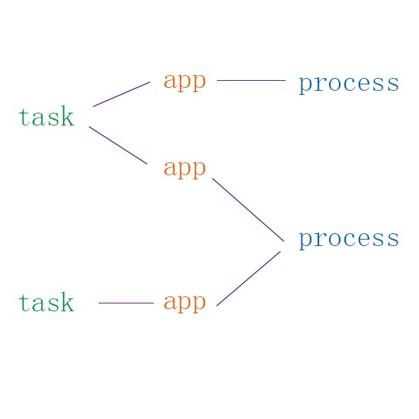

## TASK和BACKSTACK（本篇章核心）

 对Task和backStack的认识过程

1.由demo测试得到的关系图：

 

* 一个task中可以有多个app的Activity，

* 由于一个app可以对应一个或多个process，

* 所以一个task也可以对应多个process。

**2.由adb shell dumpsys activity测试得到的关系图：**

* Android将所有的task维护在Main stack中，

* 每个task由TaskId唯一标识，在Hist中包含了处于同一个task内的Activity，

* 不同的process（拥有不同的PID）中，可以包含同一个app的不同Activity，

* 一个package标识一个Application。

 

**3.通过学习源码得到的关系图： **

* 在ActivityManagerService中，由一个ActivityStack对象维护回退栈，而具体到ActivityStack中，由mHistory来维护回退栈（是一个ArrayList，而非Stack）。

* 每个Task即为一个TaskRecord对象，

* TaskRecord没有为每个Task维护一个自己的stack或list，

* mHistory中，不是直接管理Activity，而是维护ActivityRecord对象，

* ActivityRecord对象通过TaskRecord与自己所属的Task关联起来，

* ActivityRecord对象通过Activity info对象与对应的Activity关联起来，

* 分析ActivityStack中的moveTaskToFrontLocked()等对Task进行操作的代码，得到，同一个task的ActivityRecord在mHistory中是放在一起的（按照先入先出的顺序），当一个task被调到前台时，这个mHistory中，属于同一个task（taskId一致）的ActivityRecord被一起移到mHistory的顶端（在这个ArrayList中，以最后一个元素所在的位置为top，top=size()-1）;