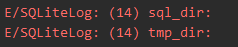
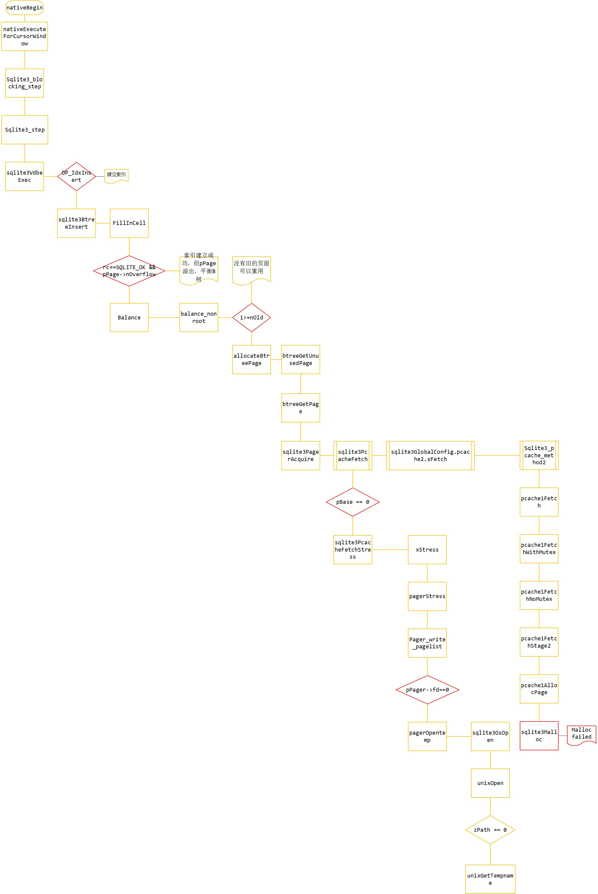

## SQLITE在ANDROID上的一个BUG：
> SQLiteCantOpenDatabaseException: unable to open database file

先上log

```
12-14 19:51:30.346 17770-18098/com.company.product W/System.err: com.company.product.database.sqlite.SQLiteCantOpenDatabaseException: unable to open database file (code 14)

12-14 19:51:30.346 17770-18098/com.company.product W/System.err:     at com.company.product.database.sqlite.SQLiteConnection.nativeExecuteForCursorWindow(Native Method)

12-14 19:51:30.346 17770-18098/com.company.product W/System.err:     at com.company.product.database.sqlite.SQLiteConnection.executeForCursorWindow(SQLiteConnection.java:913)

12-14 19:51:30.346 17770-18098/com.company.product W/System.err:     at com.company.product.database.sqlite.SQLiteSession.executeForCursorWindow(SQLiteSession.java:819)

12-14 19:51:30.346 17770-18098/com.company.product W/System.err:     at com.company.product.database.sqlite.SQLiteQuery.fillWindow(SQLiteQuery.java:62)

12-14 19:51:30.346 17770-18098/com.company.product W/System.err:     at com.company.product.database.sqlite.SQLiteCursor.fillWindow(SQLiteCursor.java:159)

12-14 19:51:30.346 17770-18098/com.company.product W/System.err:     at com.company.product.database.sqlite.SQLiteCursor.getCount(SQLiteCursor.java:147)

12-14 19:51:30.346 17770-18098/com.company.product W/System.err:     at com.company.product.database.sqlite.AbstractCursor.moveToPosition(AbstractCursor.java:218)

12-14 19:51:30.346 17770-18098/com.company.product W/System.err:     at com.company.product.database.sqlite.AbstractCursor.moveToFirst(AbstractCursor.java:258)
```

先给出结论，


- **这是sqlite在Android系统上的一个bug，在需要建立索引的sql语句频繁执行时，会发生这个异常。**

- **（如果你是在SQLiteDatabase执行open()时看到的这个exception，那应该是线程冲突的问题，跟这篇文章讲的不是同一个）**

- **根本原因是sqlite临时文件目录不可用。**

- **解决方案是第一次建立连接时设置临时文件目录。**

在项目里遇到了这样一个奇怪的crash，长期占据各个版本crash上报榜首，但在开发中一直不能重现。

在许多查DB的代码路径里，都会在moveToFirst()，getCount()等需要执行fillWindow的地方出现这个crash。

** 网络上的解决方案：**

谷歌搜索SQLiteCantOpenDatabaseException，多是一些执行SQLiteDatabase open()时线程冲突的问题，与我们这个问题不同。

跟这个问题相关的回答屈指可数，一直没找到解决方案，最相关的两种回答来自github：

https://github.com/Raizlabs/DBFlow/issues/380

https://github.com/dxopt/OpenFilesLeakTest/blob/master/bugs-show/AbstractCursor.moveToFirst.md

第一个链接与我们的情况相符，但是没有根本的解决方案，只有try – catch

第二个链接讲的是FD泄露导致打不开文件，于是我排查了app中各种泄露的地方，并且写了一个计算文件句柄数的上报工具，发现用户发生此类crash时，FD都不超过256，低于系统对单个进程默认FD数量1024的限制。排除这个可能。

（但有些时候也有可能是由这个问题引发的，可以用StrictMode detectLeak去排查）

 

于是先尝试在一些可能触发这个Exception的地方try-catch

再分析用户日志，发现try – catch住这个Exception后是可以继续执行一些DB查询的，

于是全都上了try – catch

** 重现路径**

分析用户日志，发现用户的一些共性，由于业务保密限制这里总结一下，共性是DB中数据量很大，并且查询中有大量的子查询。

于是尝试重现这个问题：

 
在数据量很大的情况下，多次查询就会重现。

可以重现的话就可以开始打log了。

为了在sqlite native层打log，编译sqlite，使用sqlite3_log来输出自己想观察的信息。

 

首先我们可以看到sqlite的log

```
12-14 19:51:30.346 17770-18098/com.company.package E/SQLiteLog: (14) cannot open file at line 32440 of [bda77dda96]

12-14 19:51:30.346 17770-18098/com.company.package E/SQLiteLog: (14) os_unix.c:32440: (30) open(./etilqs_3P2SKRP0Ge6cj3T) -

12-14 19:51:30.346 17770-18098/com.company.package E/SQLiteLog: (14) statement aborts at 180: [SELECT M.*,…………………
```
可以看到是打开一个”./etilqs_3P2SKRP0Ge6cj3T”的文件时打开失败。

先查查这个临时文件是什么鬼，

在sqlite3.c搜索前缀etilqs_里可以看到这样的注释：

```c
/*
** Temporary files are named starting with this prefix followed by 16 random
** alphanumeric characters, and no file extension. They are stored in the
** OS's standard temporary file directory, and are deleted prior to exit.
** If sqlite is being embedded in another program, you may wish to change the
** prefix to reflect your program's name, so that if your program exits
** prematurely, old temporary files can be easily identified. This can be done
** using -DSQLITE_TEMP_FILE_PREFIX=myprefix_ on the compiler command line.
**
** 2006-10-31:  The default prefix used to be "sqlite_".  But then
** Mcafee started using SQLite in their anti-virus product and it
** started putting files with the "sqlite" name in the c:/temp folder.
** This annoyed many windows users.  Those users would then do a 
** Google search for "sqlite", find the telephone numbers of the
** developers and call to wake them up at night and complain.
** For this reason, the default name prefix is changed to be "sqlite" 
** spelled backwards.  So the temp files are still identified, but
** anybody smart enough to figure out the code is also likely smart
** enough to know that calling the developer will not help get rid
** of the file.
*/
#ifndef SQLITE_TEMP_FILE_PREFIX
# define SQLITE_TEMP_FILE_PREFIX "etilqs_"
#endif
```
总之就是临时文件就对了。

 

**临时文件源码追踪**

然后找找这个东西在哪里用的，
```c
/*
** Create a temporary file name in zBuf.  zBuf must be allocated
** by the calling process and must be big enough to hold at least
** pVfs->mxPathname bytes.
*/
static int unixGetTempname(int nBuf, char *zBuf){
  static const unsigned char zChars[] =
    "abcdefghijklmnopqrstuvwxyz"
    "ABCDEFGHIJKLMNOPQRSTUVWXYZ"
    "0123456789";
  unsigned int i, j;
  const char *zDir;

  /* It's odd to simulate an io-error here, but really this is just
  ** using the io-error infrastructure to test that SQLite handles this
  ** function failing. 
  */
  SimulateIOError( return SQLITE_IOERR );

  zDir = unixTempFileDir();
  if( zDir==0 ) zDir = ".";

  /* Check that the output buffer is large enough for the temporary file 
  ** name. If it is not, return SQLITE_ERROR.
  */
  if( (strlen(zDir) + strlen(SQLITE_TEMP_FILE_PREFIX) + 18) >= (size_t)nBuf ){
    return SQLITE_ERROR;
  }

  do{
    sqlite3_snprintf(nBuf-18, zBuf, "%s/"SQLITE_TEMP_FILE_PREFIX, zDir);
    j = (int)strlen(zBuf);
    sqlite3_randomness(15, &zBuf[j]);
    for(i=0; i<15; i++, j++){
      zBuf[j] = (char)zChars[ ((unsigned char)zBuf[j])%(sizeof(zChars)-1) ];
    }
    zBuf[j] = 0;
    zBuf[j+1] = 0;
  }while( osAccess(zBuf,0)==0 );
  return SQLITE_OK;
}
```
这里可以留意到一个神奇的东西

**zDir = unixTempFileDir();**

**if( zDir==0 ) zDir = ".";**
我们的文件是 **./etilqs_3P2SKRP0Ge6cj3T**

所以**unixTempFileDir()**确实是返回了0

那再看下**unixTempFileDir();**

```c
/*
** Return the name of a directory in which to put temporary files.
** If no suitable temporary file directory can be found, return NULL.
*/
static const char *unixTempFileDir(void){
  static const char *azDirs[] = {
     0,
     0,
     0,
     "/var/tmp",
     "/usr/tmp",
     "/tmp",
       /* List terminator */
  };
  unsigned int i;
  struct stat buf;
  const char *zDir = 0;

  azDirs[0] = sqlite3_temp_directory;
  if( !azDirs[1] ) azDirs[1] = getenv("SQLITE_TMPDIR");
  if( !azDirs[2] ) azDirs[2] = getenv("TMPDIR");
  for(i=0; i<sizeof(azDirs)/sizeof(azDirs[0]); zDir=azDirs[i++]){
    if( zDir==0 ) continue;
    if( osStat(zDir, &buf) ) continue;
    if( !S_ISDIR(buf.st_mode) ) continue;
    if( osAccess(zDir, 07) ) continue;
    break;
  }
  return zDir;
}
```
azDirs[0]是sqlite3_temp_directory，我们没有设置过，

azDirs[1]和[2]是环境变量，用sqlite3_log打出来是



即环境变量里没有设置这两个值，

而另外三个目录/var/tmp，/usr/tmp，/tmp在Android系统里都是应用不可写的，

所以会返回0给unixGetTemp，

于是unixGetTemp使用了”.”作为临时文件的目录，

那”.”是哪个目录呢？

使用

```c
system(“ls . >  /sdcard/0.txt”);
```
结果是：
```shell
acct
adb_keys
cache
config
d
data
default.prop
dev
etc
firmware
fstab.qcom
init
init.goldfish.rc
init.qcom.class_core.sh
init.qcom.class_main.sh
init.qcom.rc
init.qcom.sh
init.qcom.usb.rc
init.qcom.usb.sh
init.rc
init.target.rc
init.trace.rc
init.usb.rc
mnt
persist
proc
root
sbin
sdcard
storage
storage_int
sys
system
tombstones
ueventd.goldfish.rc
ueventd.qcom.rc
ueventd.rc
vendor
```
这特么是根目录！当前工作目录是根目录我也是醉了。。。

所以在根目录创建临时文件一定会失败！

 

**etilqs临时文件创建时机**

那为什么平时使用都是正常的呢？

找一找这个临时文件的创建时机：

在unixGetTempname函数里，人为地造一个crash，通过crash堆栈配合addr2line来查看调用栈：
```
12-19 21:00:45.633 13680-14105/com.company.package E/SQLiteLog: (14) pagerstress;/data/data/com.company.package/databases/push
12-19 21:00:45.633 13680-14105/com.company.package E/SQLiteLog: (14) pager_write_pagelist
12-19 21:00:46.083 3727-3727/? I/DEBUG:     #00  pc 00037202  /data/app-lib/com.company.package-1/libqmsqlite.so unixGetTempname 32107
12-19 21:00:46.083 3727-3727/? I/DEBUG:     #01  pc 000376a7  /data/app-lib/com.company.package-1/libqmsqlite.so unixOpen 32396
12-19 21:00:46.083 3727-3727/? I/DEBUG:     #02  pc 00015ec5  /data/app-lib/com.company.package-1/libqmsqlite.so sqlite3OsOpen 17420
12-19 21:00:46.083 3727-3727/? I/DEBUG:     #03  pc 0003a16b  /data/app-lib/com.company.package-1/libqmsqlite.so
12-19 21:00:46.093 3727-3727/? I/DEBUG:     #04  pc 0003e0c7  /data/app-lib/com.company.package-1/libqmsqlite.so
12-19 21:00:46.093 3727-3727/? I/DEBUG:     #05  pc 00038e75  /data/app-lib/com.company.package-1/libqmsqlite.so
12-19 21:00:46.093 3727-3727/? I/DEBUG:     #06  pc 00038f55  /data/app-lib/com.company.package-1/libqmsqlite.so
12-19 21:00:46.093 3727-3727/? I/DEBUG:     #07  pc 00039445  /data/app-lib/com.company.package-1/libqmsqlite.so
12-19 21:00:46.093 3727-3727/? I/DEBUG:     #08  pc 0003add1  /data/app-lib/com.company.package-1/libqmsqlite.so
12-19 21:00:46.093 3727-3727/? I/DEBUG:     #09  pc 0003c1f1  /data/app-lib/com.company.package-1/libqmsqlite.so
12-19 21:00:46.093 3727-3727/? I/DEBUG:     #10  pc 0003d8df  /data/app-lib/com.company.package-1/libqmsqlite.so
12-19 21:00:46.093 3727-3727/? I/DEBUG:     #11  pc 0004c2e7  /data/app-lib/com.company.package-1/libqmsqlite.so
12-19 21:00:46.093 3727-3727/? I/DEBUG:     #12  pc 0004e317  /data/app-lib/com.company.package-1/libqmsqlite.so (sqlite3_step+334)
12-19 21:00:46.093 3727-3727/? I/DEBUG:     #13  pc 00063ebd  /data/app-lib/com.company.package-1/libqmsqlite.so (sqlite3_blocking_step+6)
12-19 21:00:46.093 3727-3727/? I/DEBUG:     #14  pc 00012279  /data/app-lib/com.company.package-1/libqmsqlite.so
12-19 21:00:46.103 3727-3727/? I/DEBUG:          61e75c04  61ced1f7  /data/app-lib/com.company.package-1/libqmsqlite.so
12-19 21:00:46.103 3727-3727/? I/DEBUG:          61e75c24  61ced6ab  /data/app-lib/com.company.package-1/libqmsqlite.so
12-19 21:00:46.103 3727-3727/? I/DEBUG:          61e75c50  61d71f4c  /data/app-lib/com.company.package-1/libqmsqlite.so
12-19 21:00:46.113 3727-3727/? I/DEBUG:          61e7610c  61cf016f  /data/app-lib/com.company.package-1/libqmsqlite.so```
使用addr2line –C –f –e 加上面14个pc地址，结果：
```
pagerOpentemp
/media/Software/company/qmsqlite/jni/sqlite/sqlite3.c:46566
pagerStress
/media/Software/company/qmsqlite/jni/sqlite/sqlite3.c:47482
sqlite3PcacheFetchStress
/media/Software/company/qmsqlite/jni/sqlite/sqlite3.c:40751
btreeGetPage
/media/Software/company/qmsqlite/jni/sqlite/sqlite3.c:56428
btreeGetUnusedPage
/media/Software/company/qmsqlite/jni/sqlite/sqlite3.c:56556
allocateBtreePage
/media/Software/company/qmsqlite/jni/sqlite/sqlite3.c:60283
balance_nonroot
/media/Software/company/qmsqlite/jni/sqlite/sqlite3.c:61869
sqlite3BtreeInsert
/media/Software/company/qmsqlite/jni/sqlite/sqlite3.c:62554
sqlite3VdbeExec
/media/Software/company/qmsqlite/jni/sqlite/sqlite3.c:77746 (discriminator 3)
sqlite3Step
/media/Software/company/qmsqlite/jni/sqlite/sqlite3.c:71550
sqlite3_blocking_step
/media/Software/company/qmsqlite/jni/sqlite/sqlite3_unlock_notify.c:85 (discriminator 1)
nativeExecuteForCursorWindow
/media/Software/company/qmsqlite/jni/sqlite/SQLiteConnection.cpp:994
```



**懒得看图的童鞋还是听我说吧，**

先看sqlite的architecture


因为我们crash的地方是查DB的地方，所以拿query操作来解释这个architecture是怎么运行的

 
先用SQL Command Processor解析sql语句，变成类似汇编的命令给Virtual Machine执行，

我们可以用explain plan select …. 这样的语句来查看virtual machine要执行的命令，比如
```sql
explain plan select * from A where A.a in (select b from B)
```
对应的命令是：
```asm
 0| Trace| 0| 0| 0| | 00
 1| Goto| 0| 56| 0| | 00
 2| OpenRead| 0| 4| 0| 13| 00
 3| Rewind| 0| 54| 0| | 00
 4| null| 0| 1| 0| | 00
 5| Once| 0| 17| 0| | 00
 6| null| 0| 1| 0| | 00
 7| OpenEphemeral| 4| 1| 0| keyinfo(1,BINARY)| 00
 8| Integer| 10000| 2| 0| | 00
 9| OpenRead| 1| 5| 0| 1| 00
 10| Rewind| 1| 16| 0| | 00
 11| Column| 1| 0| 3| | 00
 12| MakeRecord| 3| 1| 4| b| 00
 13| IdxInsert| 4| 4| 0| | 00
 14| IfZero| 2| 16| -1| | 00
 15| Next| 1| 11| 0| | 01
 16| Close| 1| 0| 0| | 00
 17| Column| 0| 0| 4| | 00
 18| IsNull| 4| 22| 0| | 00
 19| Affinity| 4| 1| 0| b| 00
 20| NotFound| 4| 22| 4| 1| 00
 21| Goto| 0| 39| 0| | 00
 22| null| 0| 5| 0| | 00
 23| Once| 1| 35| 0| | 00
 24| null| 0| 5| 0| | 00
 25| OpenEphemeral| 6| 1| 0| keyinfo(1,BINARY)| 00
 26| Integer| 10000| 6| 0| | 00
 27| OpenRead| 2| 5| 0| 12| 00
 28| Rewind| 2| 34| 0| | 00
 29| Column| 2| 11| 7| | 00
 30| MakeRecord| 7| 1| 4| b| 00
 31| IdxInsert| 6| 4| 0| | 00
 32| IfZero| 6| 34| -1| | 00
 33| Next| 2| 29| 0| | 01
 34| Close| 2| 0| 0| | 00
 35| Column| 0| 1| 4| | 00
 36| IsNull| 4| 53| 0| | 00
 37| Affinity| 4| 1| 0| b| 00
 38| NotFound| 6| 53| 4| 1| 00
 39| Column| 0| 0| 8| | 00
 40| Column| 0| 1| 9| | 00
 41| Column| 0| 2| 10| | 00
 42| Column| 0| 3| 11| | 00
 43| Column| 0| 4| 12| | 00
 44| Column| 0| 5| 13| | 00
 45| Column| 0| 6| 14| | 00
 46| Column| 0| 7| 15| | 00
 47| Column| 0| 8| 16| | 00
 48| Column| 0| 9| 17| | 00
 49| Column| 0| 10| 18| | 00
 50| Column| 0| 11| 19| | 00
 51| Column| 0| 12| 20| | 00
 52| ResultRow| 8| 13| 0| | 00
 53| Next| 0| 4| 0| | 01
 54| Close| 0| 0| 0| | 00
 55| Halt| 0| 0| 0| | 00
 56| Transaction| 0| 0| 0| | 00
 57| VerifyCookie| 0| 3| 0| | 00
 58| TableLock| 0| 4| 0| labels| 00
 59| TableLock| 0| 5| 0| Items| 00
 60| Goto| 0| 2| 0| | 00
```
可以看到其中需要建立索引，IdxInsert，于是在sqlite3VdbeExec中会进入

  **OP_IdxInsert分支**，然后

  **会调用sqlite3BtreeInsert**，向B树中插入一个节点，

  此时如果pPage满了，会执行**balance**平衡B树，

  在这里面就会**btreeGetPage**去获取可用的page，

  获取page的过程最终会执行**sqlite3_malloc**，为page分配空间，一旦分配失败，就会在**fetch**处触发pBase == 0的条件，

  于是执行**sqlite3PcacheFetchStress**，在其中调用**pager_write_pagelist**时触发**pPager->fd == 0**的条件（因为page在前面没有分配到空间），

  于是触发**pagerOpenTemp**，往下执行调用**unixGetTempname**，得到上面所说的那个不正确的文件路径，

  执行**sqlite3Osopen**时就会失败。

 

从上面的分析看出，触发这个路径需要几个条件：

- 执行的sql语句需要建立索引，
- B树不平衡
- 没有设置过环境变量
- 分配的内存不足以新建新的page
所以触发条件还是比较严格的。

在**unixOpenTempname**执行时用一个变量计算临时文件的打开次数，也可以发现确实是一打开这样的文件就会失败（在打开第一个的时候就失败）。

**解决方案(Solution)**

那么最重要的事情来了，怎么修复呢？

既然是临时文件的目录没有写权限，那就改目录吧！

翻了翻sqlite的一些资料，找到了这样一个programa

http://www.sqlite.org/c3ref/temp_directory.html
```sql
PRAGMA temp_store_directory = 'your dir'
```
这个东西仅对当前SqliteConncetion有效，

在第一次建立sqlite连接的时候（我是重写了getReadabelDatabase()方法），设置一下临时文件目录，like this:

```java
private static boolean mainTmpDirSet = false;
@Override
    public SQLiteDatabase getReadableDatabase() {
        if (!mainTmpDirSet) {
            boolean rs = new File("/data/data/com.cmp.pkg/databases/main").mkdir();
            Log.d("ahang", rs + "");
            super.getReadableDatabase().execSQL("PRAGMA temp_store_directory = '/data/data/com.cmp.pkg/databases/main'");
            mainTmpDirSet = true;
            return super.getReadableDatabase();
        } 
        return super.getReadableDatabase();
    }
```
然后再去执行那些繁重的查询，你会发现问题消失了，

并且sqlite3会在不需要这个临时文件时自动删除它，所以你不需要做一套清理逻辑。

于是问题解决!


