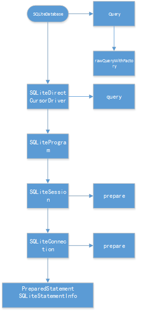
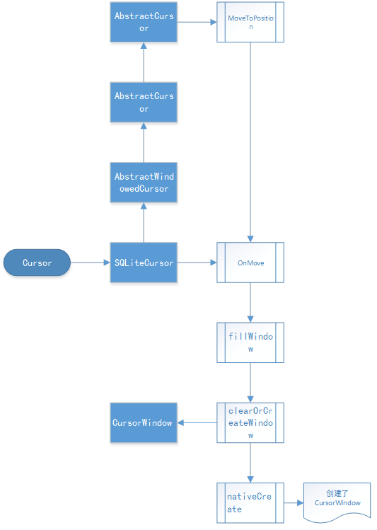
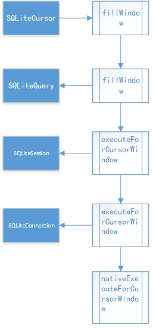

## 从源码看ANDROID中SQLITE是怎么通过CURSORWINDOW读DB的

**执行QUERY**

执行SQLiteDatabase类中query系列函数时，只会构造查询信息，不会执行查询。




（query的源码追踪路径）


**执行MOVE**（里面的FILLWINDOW是真正打开文件句柄并分配内存的地方）

当执行Cursor的move系列函数时，第一次执行，会为查询结果集创建一块共享内存，即cursorwindow


 

**moveToPosition源码路径**


**FILLWINDOW----真正耗时的地方**

 
 

然后会执行sql语句，向共享内存中填入数据，

 

**fillWindow源码路径**

在SQLiteCursor.java中可以看到

```java
@Override
public boolean onMove(int oldPosition, int newPosition) {
    // Make sure the row at newPosition is present in the window
    if (mWindow == null || newPosition < mWindow.getStartPosition() ||
            newPosition >= (mWindow.getStartPosition() + mWindow.getNumRows())) {
        fillWindow(newPosition);
    }

    return true;
}
```
如果请求查询的位置在cursorWindow的范围内，不会执行fillWindow，

而超出cursorwindow的范围，会调用fillWindow，

而在nativeExecuteForCursorWindow中，

获取记录时，如果要请求的位置超出窗口范围，会发生CursorWindow的清空：

```c
CopyRowResult cpr = copyRow(env, window, statement, numColumns, startPos, addedRows);  
if (cpr == CPR_FULL && addedRows && startPos + addedRows < requiredPos) {  
// We filled the window before we got to the one row that we really wanted. 
// Clear the window and start filling it again from here.  
// TODO: Would be nicer if we could progressively replace earlier rows.  
window->clear();  
window->setNumColumns(numColumns);  
startPos += addedRows;  
addedRows = 0;  
cpr = copyRow(env, window, statement, numColumns, startPos, addedRows);  
}
```
CursorWindow的清空机制会影响到多线程读（通常认为不可以并发读写，sqlite的并发实际上是串行执行的，但可以并发读，这里要强调的是多线程读也可能有问题），具体见稍后一篇文章“listview并发读写数据库”。

 上面说的这些直观的感受是什么样的呢？大概是这样，

  执行query，读10000条数据，很快就拿到了cursor，这里不会卡，

  执行moveToFirst，卡一下（fillwindow(0)）

  moveToPosition(7500)，卡一下，因为已经超了cursorwindow的区域，又去fillwindow(7500)，

  关于fillwindow还有一些奇特的细节，比如4.0以后，fillwindow会填充position前后各一段数据，防止读旧数据的时候又需要fill，感兴趣的同学可以看看各个版本fillwidow的源码。

  这里还可以延伸一下，因为高版本的android sqlite对旧版有许多改进，

  所以实际开发里我们有时候会把sqlite的源码带在自己的工程里，使得低版本的android也可以使用高版本的特性，并且避开一部分兼容性问题。

**CURSOR关闭**（显式调用CLOSE()的理由）

追踪源码看关闭

```java
 //SQLiteCursor

super.close();
synchronized (this) {
    mQuery.close();
    mDriver.cursorClosed();
}


//AbstractCursor

public void close() {
    mClosed = true;
    mContentObservable.unregisterAll();
    onDeactivateOrClose();
}

protected void onDeactivateOrClose() {
    if (mSelfObserver != null) {
        mContentResolver.unregisterContentObserver(mSelfObserver);
        mSelfObserverRegistered = false;
    }
    mDataSetObservable.notifyInvalidated();
}


//AbstractWindowedCursor

/** @hide */
@Override
protected void onDeactivateOrClose() {
    super.onDeactivateOrClose();
    closeWindow();
}

protected void closeWindow() {
    if (mWindow != null) {
        mWindow.close();
        mWindow = null;
    }
}

 

//SQLiteClosable

public void close() {
    releaseReference();
}

public void releaseReference() {
    boolean refCountIsZero = false;
    synchronized(this) {
        refCountIsZero = --mReferenceCount == 0;
    }
    if (refCountIsZero) {
        onAllReferencesReleased();
    }
}

//CursorWindow

@Override
protected void onAllReferencesReleased() {
    dispose();
}

private void dispose() {
    if (mCloseGuard != null) {
        mCloseGuard.close();
    }
    if (mWindowPtr != 0) {
        recordClosingOfWindow(mWindowPtr);
        nativeDispose(mWindowPtr);
        mWindowPtr = 0;
    }
}
```
跟CursorWindow有关的路径里，最终调用nativeDispose()清空cursorWindow;

当Cursor被GC回收时，会调用finalize：
```java
@Override
protected void finalize() {
    try {
        // if the cursor hasn't been closed yet, close it first
        if (mWindow != null) {
            if (mStackTrace != null) {
                String sql = mQuery.getSql();
                int len = sql.length();
                StrictMode.onSqliteObjectLeaked(
                    "Finalizing a Cursor that has not been deactivated or closed. " +
                    "database = " + mQuery.getDatabase().getLabel() +
                    ", table = " + mEditTable +
                    ", query = " + sql.substring(0, (len > 1000) ? 1000 : len),
                    mStackTrace);
            }
            close();
        }
    } finally {
        super.finalize();
    }
}
```
然而finalize()并没有释放CursorWindow，而super.finalize();里**也只是解绑了观察者，没有去释放cursorwindow**

**所以不调用cursor.close(),最终会导致cursorWindow所在的共享内存(1M或2M)泄露。**
