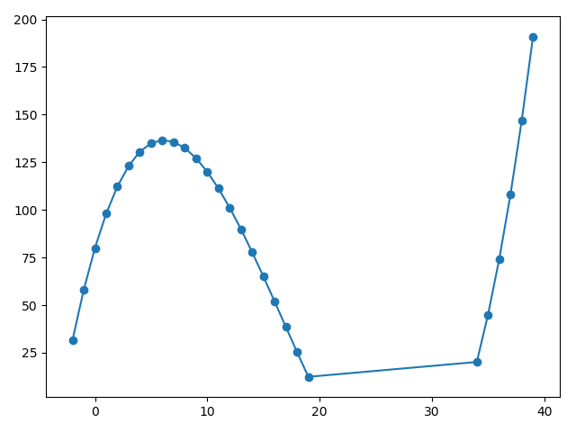

# 浅谈深度学习数据集设计

最近在和一些其他模块的同事沟通的时候，发现大家对于网络训练所需要的数据认识有很大差异，并且对于数据训练后的网络泛化性也没有感性的认识。本文尽量以与业务无关的语言，梳理一些网络训练中通用的逻辑，以形成日后数据采集和模型测试的一些准则。

TLDR:
- 模型通过训练数据，学习输入输出的映射关系；
- 数据应当尽可能全面覆盖用户场景；
- 数据清洗和数据扩增非常必要;
- 数据集测试和用户场景实测都应当重视起来；

下面开始讨论深度学习数据集设计的亿些小细节。

## Section 1. 为什么模型预测会出错

以最简单的二维曲线拟合为例，给定一堆数据点(x, y)，求一个映射y=f(x)，使得这个映射能够描述这些数据点x和y的对应关系。首先我们必须承认，由于数据的不完整，不可能存在一个模型，能够完美预测所有未知数据点的分布，面对未知，请保持敬畏。网络在设计和训练的时候，一方面是调整节点之间的连接，构造不同的搜索空间，另一方面是优化权重，在搜索空间中找到最能描述当前数据点的一个映射。以下面这条曲线对应的数据点及其拟合为例，我们来分类讨论项目中常见的一些问题：


$$y=-2x^2+80+20x+x^3/25$$

### 1.1 小数据到大数据

> 情景1：某个模型，在早期的一组数据上做实验，效果看起来挺不错的，但运用到大规模测试中的时候，效果拉跨。

我们用曲线中一部分数据点模拟“早期的实验数据”：

```python
# 生成代码
import matplotlib.pyplot as plt

def func(x):
    return -2 * (x ** 2) + 80 + 20 * x + (x**3)/25

def draw_left():
    xs = []
    ys = []
    for i in range(-10, 20):
        xs.append(i)
        ys.append(func(xs[-1]))
    return xs, ys

if __name__ == '__main__':
    xs, ys = draw_left()
    plt.plot(xs, ys)
    plt.scatter(xs, ys)
    plt.show()
```


假如我们的训练集只有[-10, 20]区间的数据点，模型可能会认为，这些数据的分布是一条抛物线，峰值在x=6附近，越往右，y越小；然而，真实的数据分布并非如此，当测试集位于[30, ∞]，模型的预测就会显著出错。

模型在早期的一组数据上做实验，效果看起来挺不错的，但运用到大规模测试中的时候，效果拉跨，就是陷入了上文描述的困境中。数据越相似，分布越接近，训练出来的模型也就越容易学习到局部的特征，而不能在更广阔的场景上有好的泛化，这也是我们常说的过拟合。

从上文的分析可以引申出两个小结论：

- 结论1. 场景过于单一，学习到的是局部的数据分布；
- 结论2. 相似场景的大量数据没有意义，仍然只能学到局部的数据分布；

### 1.2 数据扩增

> 情景2： 做了一堆数据扩增，但模型有了一些改善，但在大规模测试中仍然失效。

在情景1的基础上，假如我们对原始数据做扩增，可以在原始数据附近得到一些新的数据点：

```python
def draw_aug_left():
    xs = []
    ys = []
    import random
    for i in range(-10, 20):
        xs.append(i + random.randint(-15, 15))
        ys.append(func(xs[-1]))

    xs, ys = zip(*sorted(zip(xs, ys)))
    return xs, ys
```

为了模拟数据扩增的随机性，我对x做了随机的偏移，为了提高数据扩增的威力，我为每个扩增点赋予了正确的结果func(x)，尽管实际情况中某些数据扩增可能会得到错误的结果。最终随机出来的数据分布可能长下面这样：


由于数据扩增是围绕原始数据做的变化，这些新的数据点很难离原始数据太远，在第一张图中，跟原始数据比差别不大，看不到拐点，在第二张图中，由于随机到了30附近的点，可以看到一点拐点，但仍然看不到后边上升的尾巴，模型在拐点处的表现可能改善，但仍然很难学习到30以后的数据分布趋势。

从上文的分析可以引申处两个结论：

- 结论3：数据扩增能一定程度上避免过拟合；
- 结论4：数据扩增围绕少量数据进行，仍然可能过拟合局部数据分布；

### 1.3 样本平衡
> 情景3：采集了很多数据都是正样本，没有多少负样本，测试的时候遇到负样本预测出错。

假设我们的数据集有了较广的分布，但只有x轴以上的点：

```python
def draw_pos_sample():
    xs = []
    ys = []
    for i in range(-10, 40):
        y = func(i)
        if y > 20 or random.random() > 0.99:
            xs.append(i)
            ys.append(y)
    return xs, ys
```



模型没见过多少负样本，没法知道y<0的样本变化趋势，只能根据x轴以上的数据点做大致的外推，给定一个[20, 30]区间的输入，预测值大概率低于f(20)，但具体值应该是多少就很难保证了。

从上文分析可以引申处一个结论：
- 结论5：样本失衡时，数据量少的样本类型预测容易出错；

### 1.4 脏数据
情景4：数据标注的时候，某两类数据很像，有些样本标错了，测试时这两类数据总是预测失败，连带其他数据表现也变差了。


```python
def draw_dirty_sample():
    xs = []
    ys = []
    for i in range(0, 35):
        xs.append(i)
        y = func(xs[-1])
        if random.random() > 0.9:
            ys.append(random.randint(-100, 100))
        else:
            ys.append(func(xs[-1]))
    return xs, ys
```


我们在曲线数据里随机加一些脏数据，曲线的样子就大不相同，遇上这样的数据，模型肯定学不出[30, ∞]曲线上升的趋势了。情景4中标错的数据也与我们的随机数据相似，会影响整个模型的参数，导致标错的数据类型及相似的数据类型表现不佳。

从上文分析可以引申出一个结论：

- 结论6：脏数据（尤其是关键拐点处）会严重影响模型识别效果。


测试场景是无限的，训练集无法覆盖所有的目标场景，从上面的分析我们可以看出，如果要让有限的数据训练出的模型，在尽可能多的场景上达到最大的泛化能力，关键就在于要让训练集的数据分布尽可能覆盖目标测试场景数据分布。所以问题变成了怎么确定目标测试场景数据分布

## Section 2. 我们需要什么样的数据
### 2.1 目标测试场景数据分布

2.1.1 模型可能有哪些输入？

这其实是一个需求分析问题，当我们拿到一个NN相关需求的时候，就需要问，我的输入是什么样的：用户可能在哪些场景下触发这个模型的识别？室内还是室外？是否所有天气状况都需要工作？识别目标的尺寸是怎样的？变化范围有多大？输入的图像是灰度图还是彩色图？标定是否正常，图像是否有畸变？成像信噪比如何？各种场景中是否有明显的Corner case是人也区分不开的？如果确实有区分不开的数据，是否能够增加更多的输入信息？考虑清楚这一系列问题之后，需要制定一个完备的数据采集场景list，覆盖采集对应的数据。采集时还需要注意，相似场景不需要过多采集，优先提高场景的丰富性而非数量。


2.1.2 模型需要有怎样的输出？

这也是一个需求分析问题，但更侧重于上下游的联调：下游希望我们有什么样的输出？输出的变化范围有多大？下游希望输出有多高的准确率？如果给出置信度和输出，是否能容忍一部分预测出错？什么样的错误预测是下游可以通过其他渠道识别并排除的？什么样的错误预测是绝对不允许的？召回率更重要还是准确率更重要？讨论清楚这一系列问题之后，才能调整优化方向，让有限的模型在下游更关切的方向上有更好的预测效果。

### 2.2 数据后处理

当我们根据最终业务需求，与上下游一起，确认模型的工作范围，并采集分布尽可能广的数据之后，往往还需要针对Section 1提到的几种模型容易出错的场景，对数据进行处理。

相似样本不需要太多，可以适当降频采样，从而实现样本的平衡性，提高数据丰富性。

由于采集精力有限，我们为了覆盖尽可能广的数据分布，单个场景的数据往往就没有那么多，因此数据增强就非常重要了。亮度变化，随机噪声，遮挡，翻转平移缩放，仿射变换，生成数据，很多时候都能提高泛化性。

脏数据一定要挑出来修正或去除。脏数据不仅是指标签不对的数据或者标注精度不够的数据，更重要的是那些不利于模型形成正确分布的数据，例如分类问题，图中同时有多个类别，模型就不知道自己该学成什么样。标注时一定程度上需要根据模型的拟合能力来定好标注原则，使得标注更容易学习。

## Section 3. 模型测试

先讲数据集上的测试，即测试集的设计。原则上测试集的分布要与训练集相同，因此测试集的采集一般要与训练集同步进行，沿用相同的采集list；但是，测试集必须与训练集有差异，否则就只能称之为验证集了。实际操作中，可以在不同的城市采集相同场景的数据，或者同个地点，这周采训练集，下周采测试集，以保证训练测试是有一定差异的，保证模型过拟合能被发现。

模型测试不仅包含数据集上的测试，还包含与上下游联调起来之后的实际场景测试。很多时候，测试集上99%的准确率，不如一次成功的demo更能让人信服。实测成功意味着你的模型确实正常工作起来了，准确率和速度都达到了下游的需求，要达到这一点，往往需要克服各种模型部署中的困难，可能需要替换掉某些无法实现的算子，或者压缩模型以达到推理速度的需求，可能会导致泛化性下降，具体部署相关的问题可以再另写一篇文章讨论，这里先讲实测中的数据问题。

实测的场景一方面要包含训练list中的各种场景，另一方面更要像用户一样测试。数据集设计时往往我们会为了数据平衡，导致普通场景数据比例没有实测中那么多；但像用户一样测试，往往普通场景会测得更多，更多发现普通场景中不work的数据，对于这类数据，出于优先保证用户最常见的场景体验，需要将其补充进训练集中。

测试应当尽早开展，一边测试，一边采集。测试得到大量的新数据，如果全部加入训练，就会打乱原来的数据分布。更好的策略是，用初版模型筛出困难场景，能够预测成功的场景，就没必要加太多了，预测失败的数据更有价值，从而更有针对性地优化模型。但如果是一些模型能力范围之外的数据（比如行人识别任务遇到了穿玩偶服的人），就不能加入训练数据之中了，也许下一版本设计新的模型（比如增加一个类用来识别熊本熊？）来解决。

## 写在最后
深度学习是一个数据驱动算法，模型越小，对数据的质量要求越高；采集设备搭建，数据集设计，采集，分析，清洗，增强，测试往往要占到算法一半以上的工作量。如果下次你的模型预测出错了，不如花点时间，把数据集再整整，说不定会有惊喜发生。