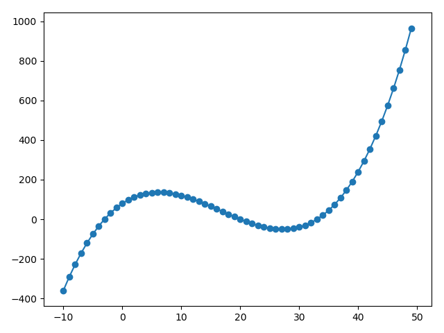
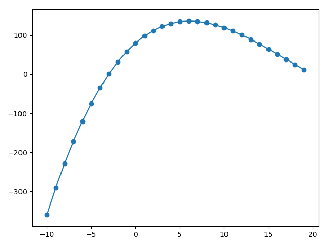
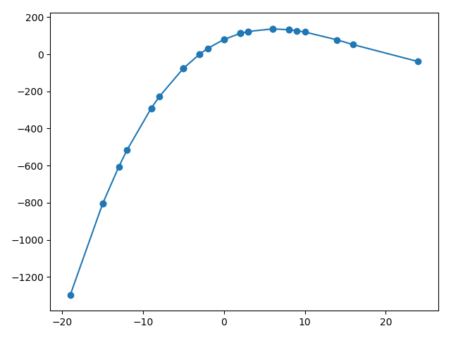
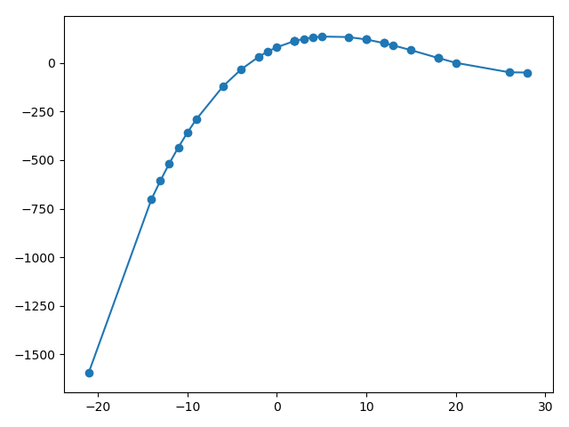

# 实用数据集设计

最近在和一些其他模块的同事沟通的时候，发现大家对于网络训练所需要的数据认识有很大差异，并且对于数据训练后的网络泛化性也没有感性的认识，因此本文尽量以与业务无关的语言，梳理一些网络训练中通用的逻辑，以形成日后数据采集和模型测试的一些准则。

## 深度学习，到底在学什么

以最简单的二维曲线拟合为例，给定一堆数据点(x, y)，求一个映射f(θ，x, y)，使得这个映射能够描述这些数据点x和y的对应关系。首先我们必须承认，由于数据的不完整，不可能存在一个模型，能够完美预测所有未知数据点的分布，面对未知，请保持敬畏。网络在设计和训练的时候，一方面是调整节点之间的连接，构造不同的搜索空间，另一方面是优化权重，在搜索空间中找到最能描述当前数据点的一个映射。以下面这条曲线对应的数据点及其拟合为例，我们来分类讨论项目中常见的一些问题：




$$y=-2x^2+80+20x+x^3/25$$

## 问题1：小数据到大数据

> 情景1：某个模型，在早期的一组数据上做实验，效果看起来挺不错的，但运用到大规模测试中的时候，效果拉跨。

```python
# 生成代码
import matplotlib.pyplot as plt

def func(x):
    return -2 * (x ** 2) + 80 + 20 * x + (x**3)/25

def draw_left():
    xs = []
    ys = []
    for i in range(-10, 20):
        xs.append(i)
        ys.append(func(xs[-1]))
    return xs, ys

if __name__ == '__main__':
    xs, ys = draw_left()
    plt.plot(xs, ys)
    plt.scatter(xs, ys)
    plt.show()
```




假如我们的训练集只有[-10, 20]区间的数据点，模型可能会认为，这些数据的分布是一条抛物线，峰值在x=6附近，越往右，y越小；然而，真实的数据分布并非如此，当测试集位于[30, ∞]，模型的预测就会显著出错。

模型在早期的一组数据上做实验，效果看起来挺不错的，但运用到大规模测试中的时候，效果拉跨，就是陷入了上文描述的困境中。数据越相似，分布越接近，训练出来的模型也就越容易学习到局部的特征，而不能在更广阔的场景上有好的泛化，这也是我们常说的过拟合。

从上文的分析可以引申出两个小结论：

- 结论1. 场景过于单一，学习到的是局部的数据分布；
- 结论2. 相似场景的大量数据没有意义，仍然只能学到局部的数据分布；

## 问题2：数据扩增

> 情景2： 做了一堆数据扩增，但模型有了一些改善，但在大规模测试中仍然失效。

在问题1的基础上，假如我们对原始数据做扩增，可以在原始数据附近得到一些新的数据点：

```python
def draw_aug_left():
    xs = []
    ys = []
    import random
    for i in range(-10, 20):
        xs.append(i + random.randint(-15, 15))
        ys.append(func(xs[-1]))

    xs, ys = zip(*sorted(zip(xs, ys)))
    return xs, ys
```

为了模拟数据扩增的随机性，我对x做了随机的偏移，为了提高数据扩增的威力，我为每个扩增点赋予了正确的结果func(x)，尽管实际情况中某些数据扩增可能会得到错误的结果。最终随机出来的数据分布可能长下面这样：






由于数据扩增是围绕原始数据做的变化，这些新的数据点很难离原始数据太远，在第一张图中，跟原始数据比差别不大，看不到拐点，在第二张图中，由于随机到了30附近的点，可以看到一点拐点，但仍然看不到后边上升的尾巴，模型在拐点处的表现可能改善，但仍然很难学习到30以后的数据分布趋势。

从上文的分析可以引申处两个结论：

- 结论3：数据扩增能一定程度上避免过拟合；
- 结论4：数据扩增围绕少量数据进行，仍然可能陷入过拟合局部数据分布；


假设我们的数据集有了较广的分布，但只有x轴以上的点，此时学习到的模型可能是这样：

但假如我们做了数据扩增，在每个数据点周围做随机的采样，
测试场景是无限的，训练集无法覆盖所有的目标场景，但应当根据最终业务需求，与上下游一起，确认模型的工作范围，并覆盖工作范围内各种排列组合对应的数据。
测试应当尽早开展，以测代采，用初版模型筛出困难场景，可以更有针对性地优化模型。
数据增强非常重要，亮度，随机噪声，遮挡，翻转平移缩放，仿射变换，生成数据，很多时候都能提高泛化性。
数据不能只有数量，数据的丰富性更为重要，单个场景采一天不如十个场景每个采十分钟。
脏数据一定要挑出来修正或去除。脏数据不仅是指标签不对的数据或者标注精度不够的数据，更重要的是那些不利于模型形成正确分布的数据，例如分类问题，图中同时有多个类别，模型就不知道自己该学成什么样。标注时一定程度上需要根据模型的拟合能力来定好标注原则，使得标注更容易学习。