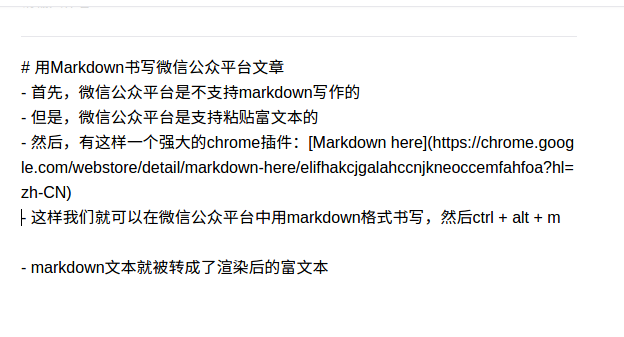
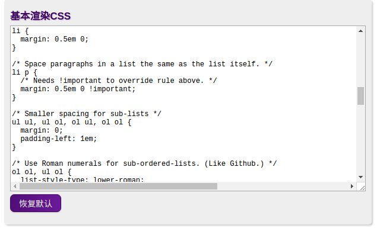
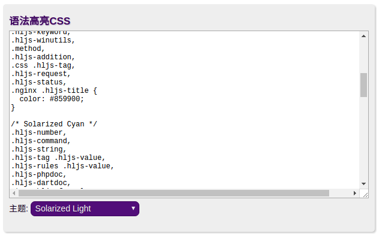
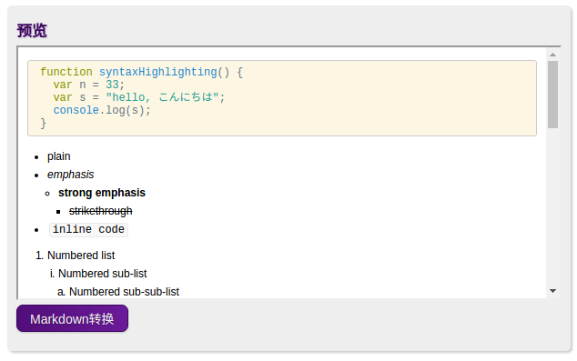

# Markdown here && 微信公众号

## 基本思路

* 首先，微信公众平台是不支持markdown写作的
* 但是，微信公众平台是支持粘贴富文本的
* 然后，有这样一个强大的chrome插件：[Markdown here](https://chrome.google.com/webstore/detail/markdown-here/elifhakcjgalahccnjkneoccemfahfoa?hl=zh-CN)
* 这样我们就可以在微信公众平台中用markdown格式书写，然后ctrl + alt + m

  

* markdown文本就被转成了渲染后的富文本

  

  **更多的自定义功能**

* 在markdown here的[设置](chrome-extension://elifhakcjgalahccnjkneoccemfahfoa/common/options.html)里，编写自己的css等

  

  

  

