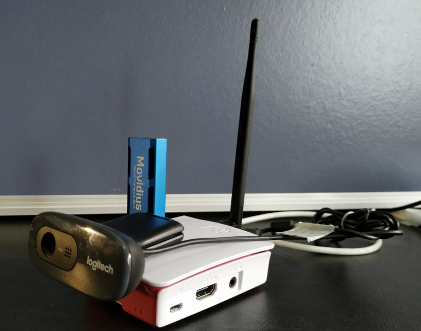
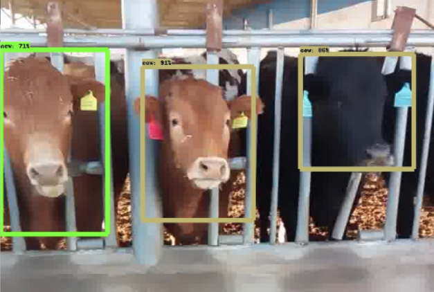
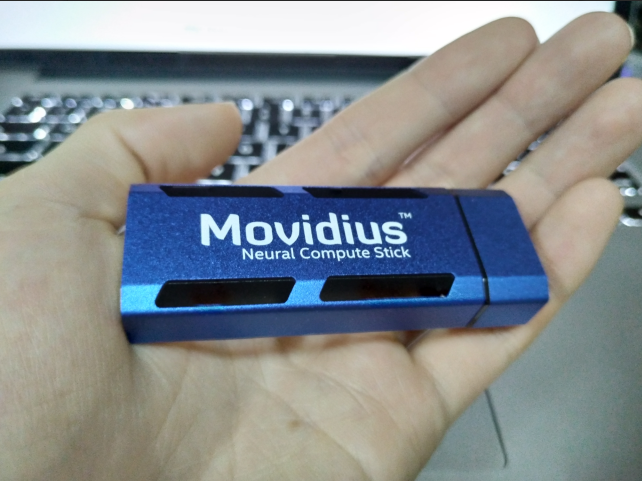

# 毫秒级检测！你见过带GPU的树莓派吗？

树莓派3B+英特尔神经计算棒进行高速目标检测

> 转载请注明作者[梦里茶](https://github.com/ahangchen)


代码: 

训练数据预处理：
https://gist.github.com/ahangchen/ae1b7562c1f93fdad1de58020e94fbdf

测试：https://github.com/ahangchen/ncs_detection

> Star是一种美德。

## Background
最近在做一个项目，要在树莓派上分析视频中的图片，检测目标，统计目标个数，这是一张样例图片：


## Motivation
当下效果最好的目标检测都是基于神经网络来做的，包括faster rcnn， ssd, yolo2等等，要在树莓派这种资源紧张的设备上运行检测模型，首先想到的就是用最轻量的MobileNet SSD，使用Tensorflow object detection api实现的MobileNet SSD虽然已经非常轻，但在树莓派上推导一张1280x720的图仍然需要2秒，有兴趣的同学可以参考这两个项目：
- armv7版Tensorflow（必须是1.4及以上）:https://github.com/lhelontra/tensorflow-on-arm/releases
- Tensorflow Object detection API: https://github.com/tensorflow/models/tree/master/research/object_detection

具体的操作在Tensorflow文档里都说的很清楚了，在树莓派上的操作也是一样的，有问题可以评论区讨论


## Hardware 
极限的模型仍然不能满足性能需求，就需要请出我们今天的主角了，[Intel Movidius Neural Computing Stick](https://developer.movidius.com/)

|处理器|Intel Movidius VPU|
| :-:| :-:  |
|支持框架|TensorFlow, Caffe|
|连接方式|USB 3.0 Type-A|
|尺寸|USB stick (72.5mm X 27mm X 14mm)
|工作温度|0° - 40° C|
| |   |
||x86_64 Ubuntu 16.04主机 |
||Raspberry Pi 3B  Stretch desktop |
||Ubuntu 16.04 虚拟机 |
|系统要求|USB 2.0 以上 (推荐 USB 3.0) |
||1GB 内存 |
||4GB 存储|
|||

实际上这不是一个GPU，而是一个专用计算芯片，但能起到类似GPU对神经网络运算的加速作用。

京东上搜名字可以买到，只要500元左右，想想一块GPU都要几千块钱，就会觉得很值了。

SDK是开源的：https://github.com/movidius/ncsdk


提问不在GitHub issue里，而是在一个专门的论坛：https://ncsforum.movidius.com/

虽然目前NCSDK支持的框架包含Tensorflow和Caffe，但并不是支持所有的模型，目前已支持的模型列表可以在这里查到：https://github.com/movidius/ncsdk/releases

截止到2018年3月15日，NCSDK还没有支持Tensorflow版的MobileNet SSD（比如`tf.cast`这个操作还未被支持），所以我们需要用Caffe来训练模型，部署到树莓派上。

## Environment
ncsdk的环境分为两部分，训练端和测试端。
- 训练端通常是一个Ubuntu 带GPU主机，训练Caffe或TensorFlow模型，编译成NCS可以执行的graph；
- 测试端则面向ncs python mvnc api编程，可以运行在树莓派上raspbian stretch版本，也可以运行在训练端这种机器上。

### 训练端
#### 安装
安装这个过程，说难不难，也就几行命令的事情，但也有很多坑

在训练端主机上，插入神经计算棒，然后：

```
git clone https://github.com/movidius/ncsdk
cd ncsdk
make install 
```

其中，make install干的是这些事情：

- 检查安装Tensorflow
- 检查安装Caffe([SSD-caffe](https://github.com/weiliu89/caffe))
- 编译安装ncsdk（不包含inference模块，只包含mvNCCompile相关模块，用来将Caffe或Tensorflow模型转成NCS graph的）

注意，
- 这些库都是安装到`/opt/movidius/`这个目录下，并关联到系统python3里边的（`/usr/bin/python3`），如果你电脑里原来有tf或caffe，也不会被关联上去
- NCSDK mvNCCompile模块目前只兼容python3，我尝试过将安装完的SDK改成兼容python2的版本，可以将模型编译出来，但是在运行时会报错，所以暂时放弃兼容python2了，也建议大家用默认的python3版本
- 这个步骤主要的坑来自万恶的Caffe，如果你装过python3版的caffe，大概会有经验一些，这里有几个小坑提示一下：
 
  - 最好在ncsdk目录中的ncsdk.conf中，开启caffe的cuda支持，即设置`CAFFE_USE_CUDA=yes`，这样你之后也能用这个caffe来训练模型
  - caffe的依赖会在脚本中安装，但有些Debian兼容问题要解决
  - 开启CUDA支持后，编译caffe会找不到libboost-python3，因为在Ubuntu16.04里，它叫libboost-python3.5，所以要软链接一下：

```bash
cd /usr/lib/x86_64-linux-gnu/
sudo ln -s libboost_python-py35.so libboost_python3.so
```
  - 其他可能出现的caffe的坑，可以在我[博客](https://github.com/ahangchen/windy-afternoon/blob/master/linux/note.md#caffe%E5%AE%98%E7%BD%91%E5%AE%89%E8%A3%85%E6%95%99%E7%A8%8B%E6%B2%A1%E5%91%8A%E8%AF%89%E4%BD%A0%E7%9A%84%E4%B8%9C%E8%A5%BF)找找答案，如果没有的话，就去caffe的GitHub issue搜吧

#### 测试
一波操作之后，我们装好了ncsdk编译模块，可以下载我训练的caffe模型，尝试编译成ncs graph
```bash
git clone https://github.com/ahangchen/MobileNetSSD
mvNCCompile example/MobileNetSSD_deploy.prototxt -w MobileNetSSD_deploy.caffemodel -s 12 -is 300 300 -o ncs_mobilenet_ssd_graph
```
这里其实是调用python3去执行/usr/local/bin/ncsdk/mvNCCompile.py这个文件， 不出意外在当前版本（1.12.00）你会遇到这个错误：

```bash
[Error 17] Toolkit Error: Internal Error: Could not build graph. Missing link: conv11_mbox_conf
```

这是因为NCSDK在处理caffe模型的时候，会把conv11_mbox_conf_new节点叫做conv11_mbox_conf，所以build graph的时候就会找不着。因此需要为这种节点起一个别名，即，将conv11_mbox_conf_new起别名为conv11_mbox_conf，修改SDK代码中的/usr/local/bin/ncsdk/Models/NetworkStage.py，在第85行后面添加：

```python
if ''_new' in name:
    self.alias.append(name[:-4])
```
于是就能编译生成graph了，你会看到一个名为ncs_mobilenet_ssd_graph的文件。

上边这个bug我已经跟NCSDK的工程师讲了，他们在跟进修这个bug：


### 测试端
#### NCSDK
测试端要安装ncsdk python api，用于inference，实际上测试端能做的操作，训练端也都能做

```
git clone https://github.com/movidius/ncsdk
cd api/src
make install
```

从输出日志可以发现，将ncsdk的lib和include文件分别和系统的python2（/usr/bin/python2）和python3(/usr/bin/python3)做了关联。

然后你可以下一个GitHub工程来跑一些测试：

```bash
git clone https://github.com/movidius/ncappzoo
cd ncappzoo/apps/hello_ncs_py
python3 hello_ncs.py
python2 hello_ncs.py
```
没报错就是装好了，测试端很简单。

#### OpenCV
看pyimagesearch这个[教程](https://www.pyimagesearch.com/2017/09/04/raspbian-stretch-install-opencv-3-python-on-your-raspberry-pi/)

## Caffe模型训练
就是正常的用caffe训练MobileNet-SSD，主要参考这个仓库：
- MobileNet-SSD: https://github.com/chuanqi305/MobileNet-SSD

README里将步骤讲得很清楚了

1. 下载SSD-caffe（这个我们已经在NCSDK里装了）
2. 下载chuanqi在VOC0712上预训练的[模型](https://drive.google.com/open?id=0B3gersZ2cHIxVFI1Rjd5aDgwOG8)
3. 把MobileNet-SSD这个项目放到SSD-Caffe的examples目录下，这一步可以不做，但是要对应修改train.sh里的caffe目录位置
4. 创建你自己的`labelmap.prototxt`，放到MobileNet-SSD目录下，比如说，你是在coco预训练模型上训练的话，可以把[coco的标签文件](https://github.com/weiliu89/caffe/blob/ssd/data/coco/labelmap_coco.prototxt)复制过来，将其中与你的目标类（比如我的目标类是Cattle）相近的类（比如Coco中是Cow）改成对应的名字，并用它的label作为你的目标类的label。（比如我用21这个类代表Cattle）
5. 用你自己的数据训练MobileNet-SSD，参考SSD-caffe的[wiki](https://github.com/weiliu89/caffe/wiki/Train-SSD-on-custom-dataset)，主要思路还是把你的数据转换成类似VOC或者COCO的格式，然后生成lmdb，坑也挺多的：
- 假设你的打的标签是这样一个文件`raw_label.txt`，假装我们数据集只有两张图片：

```
data/strange_animal/1017.jpg 0.487500	0.320675	0.670000	0.433193
data/strange_animal/1018.jpg 0.215000	0.293952	0.617500	0.481013
```
- 我们的目标是将标签中涉及的`图片和位置信息`转成这样一个目录（在ssd-caffe/data/coco目录基础上生成的）：
```
coco_cattle
├── all # 存放全部图片和xml标签文件
│   ├── 1017.jpg
│   ├── 1017.xml
│   ├── 1018.jpg
│   └── 1018.xml
├── Annotations # 存放全部标签xml
│   ├── 1017.xml
│   └── 1018.xml
├── create_data.sh # 将图片转为lmdb的脚本
├── create_list.py # 根据ImageSets里的数据集划分文件，生成jpg和xml的对应关系文件到coco_cattle目录下，但我发现这个对应关系文件用不上
├── images  # 存放全部图片
│   ├── 1017.jpg
│   └── 1018.jpg
├── ImageSets # 划分训练集，验证集和测试集等，如果只想分训练和验证的话，可以把minival.txt,testdev.txt,test.txt内容改成一样的
│   ├── minival.txt 
│   ├── testdev.txt
│   ├── test.txt
│   └── train.txt
├── labelmap_coco.prototxt # 如前所述的标签文件，改一下可以放到MobileNet-SSD目录下
├── labels.txt
├── lmdb # 手动创建这个目录
│   ├── coco_cattle_minival_lmdb # 自动创建的，由图片和标签转换来的LMDB文件
│   ├── coco_cattle_testdev_lmdb
│   ├── coco_cattle_test_lmdb
│   └── coco_cattle_train_lmdb
├── minival.log
├── README.md
├── testdev.log
├── test.log
└── train.log
```

- 其中，标签xml的格式如下：

```xml
<annotation>
  <folder>train</folder>
  <filename>86</filename>
  <source>
    <database>coco_cattle</database>
  </source>
  <size>
    <width>720</width>
    <height>1280</height>
    <depth>3</depth>
  </size>
  <segmented>0</segmented>
  <object>
    <name>21</name>
    <pose>Unspecified</pose>
    <truncated>0</truncated>
    <difficult>0</difficult>
    <bndbox>
      <xmin>169</xmin>
      <ymin>388</ymin>
      <xmax>372</xmax>
      <ymax>559</ymax>
    </bndbox>
  </object>
  <object>
    <name>21</name>
    <pose>Unspecified</pose>
    <truncated>0</truncated>
    <difficult>0</difficult>
    <bndbox>
      <xmin>169</xmin>
      <ymin>388</ymin>
      <xmax>372</xmax>
      <ymax>559</ymax>
    </bndbox>
  </object>
</annotation>
```
代表一张图中多个对象所在位置（bndbox节点表示），以及类别（name）。

- 一开始，`all`, `Annotations`, `images`, `ImageSets`,`lmdb`四个目录都是空的，你可以把自己的图片放到随便哪个地方，只要在raw_label.txt里写好图片路径就行
- 读取`raw_label.txt`，利用`lxml`构造一棵dom tree，然后写到`Annotations`对应的xml里，并将对应的图片移动到`image`目录里，可以参考[这份代码](https://gist.github.com/ahangchen/ae1b7562c1f93fdad1de58020e94fbdf)。并根据我们设置的train or not标志符将当前这张图片分配到训练集或测试集中（也就是往ImageSet/train.txt中写对应的图片名）

- 这样一波操作之后，我们的`images`和`Annotations`目录里都会有数据了，接下来我们需要把它们一块复制到`all`目录下

```shell
cp images/* all/
cp Annotations/* all/
```

- 然后用create_data.sh将`all`中的数据，根据`ImageSet`中的数据集划分，创建训练集和测试集的lmdb，这里对coco的create_data.sh做了一点修改：

```bash
cur_dir=$(cd $( dirname ${BASH_SOURCE[0]} ) && pwd )
root_dir=$cur_dir/../..

cd $root_dir

redo=true
# 这里改成all目录
data_root_dir="$cur_dir/all"
# 这里改成自己的数据集名，也是我们这个目录的名字
dataset_name="coco_cattle"
# 指定标签文件
mapfile="$root_dir/data/$dataset_name/labelmap_coco.prototxt"
anno_type="detection"
label_type="xml"
db="lmdb"
min_dim=0
max_dim=0
width=0
height=0

extra_cmd="--encode-type=jpg --encoded"
if $redo
then
  extra_cmd="$extra_cmd --redo"
fi
for subset in minival testdev train test
do
  python3 $root_dir/scripts/create_annoset.py --anno-type=$anno_type --label-type=$label_type --label-map-file=$mapfile --min-dim=$min_dim --max-dim=$max_dim --resize-width=$width --resize-height=$height --check-label $extra_cmd $data_root_dir $root_dir/data/$dataset_name/ImageSets/$subset.txt $data_root_dir/../$db/$dataset_name"_"$subset"_"$db examples/$dataset_name 2>&1 | tee $root_dir/data/$dataset_name/$subset.log
done
```
于是会lmdb目录下会为每个划分集合创建一个目录，存放数据
```
├── lmdb
│   ├── coco_cattle_minival_lmdb
│   │   ├── data.mdb
│   │   └── lock.mdb
│   ├── coco_cattle_testdev_lmdb
│   │   ├── data.mdb
│   │   └── lock.mdb
│   ├── coco_cattle_test_lmdb
│   │   ├── data.mdb
│   │   └── lock.mdb
│   └── coco_cattle_train_lmdb
│       ├── data.mdb
│       └── lock.mdb

```
6. 将5生成的lmdb链接到MobileNet-SSD的目录下：

```bash
cd MobileNet-SSD
ln -s PATH_TO_YOUR_TRAIN_LMDB trainval_lmdb
ln -s PATH_TO_YOUR_TEST_LMDB test_lmdb
```
7. 运行`gen_model.sh`生成三个prototxt（train, test, deploy）

```
# 默认clone下来的目录是没有example这个目录的，而gen_model.sh又会把文件生成到example目录
mkdir example
./gen_model.sh
```

8. 训练
```
./train.sh
```
这里如果爆显存了，可以到`example/MobileNetSSD_train.prototxt`修改batch size，假如你batch size改到20，刚好可以吃满GTX1060的6G显存，但是跑到一定步数（设置在`solver_test.prototxt`里的test_interval变量），会执行另一个小batch的test（这个batch size定义在`example/MobileNetSSD_test.prototxt`里），这样就会再爆显存，所以如果你的` train_batch_size + test_batch_size <= 20`的话才可以保证你在6G显存上能顺利完成训练，我的设置是` train_batch_size=16, test_batch_size=4`

一开始的training loss可能比较大，30左右，等到loss下降到2.x一段时间就可以ctrl+c退出训练了，模型权重会自动保存在snapshot目录下

9. 运行merge_bn.py将训练得到的模型去除bn层，得到可部署的Caffe模型，这样你就能得到一个名为`MobileNetSSD_deploy.caffemodel`的权重文件，对应的prototxt为`example/MobileNetSSD_deploy.prototxt`

10. 离题那么久，终于来到主题，我们要把这个caffemodel编译成NCS可运行的graph，这个操作之前在搭环境的部分也提过：

```
mvNCCompile example/MobileNetSSD_deploy.prototxt -w MobileNetSSD_deploy.caffemodel -s 12 -is 300 300 -o ncs_mobilenet_ssd_graph
```

参数格式：

```shell
mvNCCompile prototxt路径 -w 权重文件路径 -s 最大支持的NCS数目 -is 输入图片宽度 输入图片高度 -o 输出graph路径
```

其实训练端相对于chuanqi的MobileNet-SSD没啥改动，甚至训练参数也不用怎么改动，主要工作还是在数据预处理上，可以参考我的[预处理代码](https://gist.github.com/ahangchen/ae1b7562c1f93fdad1de58020e94fbdf)


## 树莓派NCS模型测试
现在我们要用ncs版的ssd模型在树莓派上进行对图片做检测，这个目标一旦达成我们自然也能对视频或摄像头数据进行检测了。

###  [仓库](http://github.com/ahangchen/ncs_detection)结构

```
ncs_detection
├── data # 标签文件
│   └── mscoco_label_map.pbtxt
├── file_helper.py # 文件操作辅助函数
├── model # 训练好的模型放在这里
│   ├── ncs_mobilenet_ssd_graph
│   └── README.md
├── ncs_detection.py # 主入口
├── object_detection # 改了一下TF的Object detection包中的工具类来用
│   ├── __init__.py
│   ├── protos
│   │   ├── __init__.py
│   │   ├── string_int_label_map_pb2.py
│   │   └── string_int_label_map.proto
│   └── utils
│       ├── __init__.py
│       ├── label_map_util.py
│       └── visualization_utils.py
├── r10 # 图片数据
│   ├── 00000120.jpg
│   ├── 00000133.jpg
│   ├── 00000160.jpg
│   ├── 00000172.jpg
│   ├── 00000192.jpg
│   ├── 00000204.jpg
│   ├── 00000220.jpg
│   └── 00000236.jpg
├── README.md
└── total_cnt.txt
```

- 由于这个工程一开始是用Tensorflow Object Detection API做的，所以改了其中的几个文件来读标签和画检测框，将其中跟tf相关的代码去掉。
- TF的图片IO是用pillow做的，在树莓派上速度奇慢，对一张1280x720的图使用Image的get_data这个函数获取数据需要7秒，所以我改成了OpenCV来做IO。

### 任务目标
检测`r10`目录中的图片中的对象，标记出来，存到`r10_tmp`目录里

### 流程
- 准备目标目录

```python
def config_init(dataset_pref):
    os.system('mkdir %s_tmp' % dataset_pref)
    os.system('rm %s_tmp/*' % dataset_pref)
```
- 指定模型路径，标签位置，类别总数，测试图片路径

```python
PATH_TO_CKPT = 'model/ncs_mobilenet_ssd_graph'
PATH_TO_LABELS = os.path.join('data', 'mscoco_label_map.pbtxt')
NUM_CLASSES = 81
TEST_IMAGE_PATHS = [os.path.join(img_dir, '%08d.jpg' % i) for i in range(start_index, end_index)]
```

- 发现并尝试打开神经计算棒

```python
def ncs_prepare():
    print("[INFO] finding NCS devices...")
    devices = mvnc.EnumerateDevices()

    if len(devices) == 0:
        print("[INFO] No devices found. Please plug in a NCS")
        quit()

    print("[INFO] found {} devices. device0 will be used. "
          "opening device0...".format(len(devices)))
    device = mvnc.Device(devices[0])
    device.OpenDevice()
    return device
```

- 将NCS模型加载到NCS中

```python
def graph_prepare(PATH_TO_CKPT, device):
    print("[INFO] loading the graph file into RPi memory...")
    with open(PATH_TO_CKPT, mode="rb") as f:
        graph_in_memory = f.read()

    # load the graph into the NCS
    print("[INFO] allocating the graph on the NCS...")
    detection_graph = device.AllocateGraph(graph_in_memory)
    return detection_graph
```

- 准备好标签与类名对应关系

```python
category_index = label_prepare(PATH_TO_LABELS, NUM_CLASSES)
```

- 读取图片，由于Caffe训练图片采用的通道顺序是RGB，而OpenCV模型通道顺序是BGR，需要转换一下

```python
image_np = cv2.imread(image_path)
image_np = cv2.cvtColor(image_np, cv2.COLOR_BGR2RGB)
```

- 使用NCS模型为输入图片推断目标位置

```python
def predict(image, graph):
    image = preprocess_image(image)
    graph.LoadTensor(image, None)
    (output, _) = graph.GetResult()
    num_valid_boxes = output[0]
    predictions = []
    for box_index in range(num_valid_boxes):
        base_index = 7 + box_index * 7

        if (not np.isfinite(output[base_index]) or
                not np.isfinite(output[base_index + 1]) or
                not np.isfinite(output[base_index + 2]) or
                not np.isfinite(output[base_index + 3]) or
                not np.isfinite(output[base_index + 4]) or
                not np.isfinite(output[base_index + 5]) or
                not np.isfinite(output[base_index + 6])):
            continue

        (h, w) = image.shape[:2]
        x1 = max(0, output[base_index + 3])
        y1 = max(0, output[base_index + 4])
        x2 = min(w, output[base_index + 5])
        y2 = min(h, output[base_index + 6])
        pred_class = int(output[base_index + 1]) + 1
        pred_conf = output[base_index + 2]
        pred_boxpts = (y1, x1, y2, x2)

        prediction = (pred_class, pred_conf, pred_boxpts)
        predictions.append(prediction)

    return predictions
```

其中，首先将图片处理为Caffe输入格式，缩放到300x300，减均值，缩放到0-1范围，转浮点数

```python
def preprocess_image(input_image):
    PREPROCESS_DIMS = (300, 300)
    preprocessed = cv2.resize(input_image, PREPROCESS_DIMS)
    preprocessed = preprocessed - 127.5
    preprocessed = preprocessed * 0.007843
    preprocessed = preprocessed.astype(np.float16)
    return preprocessed
```

graph推断得到目标位置，类别，分数

```python
graph.LoadTensor(image, None)
(output, _) = graph.GetResult()
```
其中的output格式为，
```
[
    目标数量，
    class，score，xmin, ymin, xmax, ymax,
    class，score，xmin, ymin, xmax, ymax,
    ...
]
```

-  根据我们感兴趣的类别和分数进行过滤

```python
def predict_filter(predictions, score_thresh):
    num = 0
    boxes = list()
    scores = list()
    classes = list()
    for (i, pred) in enumerate(predictions):
        (cl, score, box) = pred
        if cl == 21 or cl == 45 or cl == 19 or cl == 76 or cl == 546 or cl == 32:
            if score > score_thresh:
                boxes.append(box)
                scores.append(score)
                classes.append(cl)
                num += 1
    return num, boxes, classes, scores
```

- 用OpenCV将当前图片的对象数量写到图片右上角，用pillow（tf库中的实现）将当前图片的对象位置和类别在图中标出

```python
def add_str_on_img(image, total_cnt):
    cv2.putText(image, '%d' % total_cnt, (image.shape[1] - 100, 50), cv2.FONT_HERSHEY_SIMPLEX, 1, (0, 255, 0), 2)
```
```python
result = vis_util.visualize_boxes_and_labels_on_image_array(
                image_np,
                np.squeeze(valid_boxes).reshape(num, 4),
                np.squeeze(valid_classes).astype(np.int32).reshape(num, ),
                np.squeeze(valid_scores).reshape(num, ),
                category_index,
                use_normalized_coordinates=True,
                min_score_thresh=score_thresh,
                line_thickness=8)
```

- 保存图片

```python
 cv2.imwrite('%s_tmp/%s' % (dataset_pref, image_path.split('/')[-1]),
                        cv2.cvtColor(result, cv2.COLOR_RGB2BGR))
```

- 释放神经计算棒

```python
def ncs_clean(detection_graph, device):
    detection_graph.DeallocateGraph()
    device.CloseDevice()
```

### 运行
python2 ncs_detection.py

### 结果
|框架|图片数量/张|耗时|
| :-:| :-:  |:-:  |
|TensorFlow|1800|60min|
|NCS|1800|10min|
|TensorFlow|1|2sec|
|NCS|1|0.3sec|

性能提升6倍！单张图300毫秒，可以说是毫秒级检测了。在论坛上有霓虹国的同行尝试后，甚至评价其为“超爆速”。

## 扩展
单根NCS一次只能运行一个模型，但是我们可以用多根NCS，多线程做检测，达到更高的速度，具体可以看Reference第二条。


## Reference
- https://www.pyimagesearch.com/2018/02/19/real-time-object-detection-on-the-raspberry-pi-with-the-movidius-ncs/
- https://qiita.com/PINTO/items/b97b3334ed452cb555e2

看了这么久，还不快去给[我的GitHub](https://github.com/ahangchen/ncs_detection)点star!


