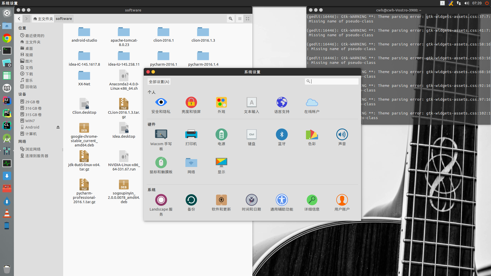

# Ubuntu安装与初始配置

转载请注明出处：https://github.com/ahangchen/windy-afternoon/blob/master/linux/ubuntu_init.md

Ubuntu版本 14.04LTS 64位

先上图



## 双系统安装

1. [划分空闲磁盘，U盘安装ubuntu](http://jingyan.baidu.com/article/60ccbceb18624464cab197ea.html)
2. 重点看安装ubuntu时的磁盘分区，ubuntu本身占的空间很小，20G能满足你的大部分好奇心了，但是建议给ubuntu100G以上的空间，才能够做长久的开发。
3. 各个分区的大小与格式安排：

|分区类型|挂载点|格式|大小|
| :-:| :-:  | :-:  | :-:  |
|逻辑分区|/boot|Ext4日志文件系统|200M|
|逻辑分区|swap（交换空间）|不用选|4096M（和内存一样大就差不多了）|
|逻辑分区|/|Ext4日志文件系统|剩下空间中，占一半，比如我还剩100G，这里就是50G|
|逻辑分区|/home|Ext4日志文件系统|剩下的所有空间|

备注：
- 由于boot分区是操作系统所在的分区，所以要保证其稳定，所以要单独分区，它很小，200M足够
- swap其实就是虚拟内存，内存大的机器可能都不会用到
- 根目录因为有/usr等目录，许多软件会安装在这里面，所以需要很大的空间
- /home目录可以用来放用户自己的文件，是最不重要的一个分区，但也不能没有这个分区，因为其他分区都不适合放用户自己的文件
4. 引导有两种方式，
- 一种是windows引导ubuntu：分区设置好后，查看/boot分区的编号，然后在下边的“安装启动引导区的设备”下拉框中选择/boot分区的编号，点击安装，然后用easybcd等方式修复ubuntu的引导，看[这里](http://blog.csdn.net/enter89/article/details/38414933)
- 一种是ubuntu引导windows：这种比较方便，不需要额外修复引导，推荐，但要删掉ubuntu的时候就比较麻烦，分区设置好后，不动“安装引导区的设备”，安装，即可
5. 语言和驱动
- 即使你想用英语装逼，我也建议你选择中文，方便后续输入法的安装
- 安装时最好联网，可以在网络连接里设置的，这样可以一边安装一边下载更新，包括语言包和一些可以自动检测的驱动
- 不建议安装那个第三方的音乐软件

6. 安装后重启即可以选择进入哪个系统

## 软件篇
- 右击启动器上的amazon，取消锁定到启动器，其他你觉得不爽的也可以取消锁定
- ctrl+alt+t打开终端，锁定到启动器
- terminal的背景调整透明
- gedit首选项中选择主题为Obilivion
- 按win键打开dash，输入snap搜到ubuntu自带的截图程序，拖动到启动器里固定
- 打开dash搜索system monitor，找到ubuntu的任务管理器，拖动到启动器固定 
- 安装附加驱动：系统设置-软件和更新-附加驱动
- 安装git：打开终端，输入：
```shell
sudo apt-get install git
```
- 安装c和c++等编译环境
```shell
sudo apt-get install build-essential 
```
- 安装XX-Net翻墙：
打开 https://github.com/XX-net/XX-Net ，下载最新release版xx-net。
```shell
sudo chmod 777 -R XX-Net
sudo ./XX-Net/start
```
- 安装chrome浏览器：在[这里下载](https://www.google.com/chrome/browser/desktop/)，下载deb包后双击安装
- 安装SwitchOmega插件到Chrome浏览器，导入ca证书
- 设置XX-Net开机启动，部署私有appid，具体看XX-Net的[wiki](https://github.com/XX-net/XX-Net/wiki/%E4%B8%AD%E6%96%87%E6%96%87%E6%A1%A3)
- 登陆自己的谷歌账号，会自动导入设置


- 卸载libreoffice系列软件：在软件中心-已安装，找libreoffice开头的软件，卸载
- 安装wps作为文档表格ppt的处理程序：[wps-社区](http://wps-community.org/downloads)，下载deb，双击安装
- [安装搜狗拼音输入法](http://blog.csdn.net/tao_627/article/details/24119037)
- 安装Oracle Java：[教程](http://www.wikihow.com/Install-Oracle-Java-on-Ubuntu-Linux)
- 软件中心搜索vlc作为视频播放器，安装
- 安装[ubuntu-tweak](http://www.linuxidc.com/Linux/2014-04/100522.htm)，可以进行美化和清理
- 安装美美的[Flatabulous主题](http://www.xulukun.cn/flatabulous-ubuntu.html)
- 软件中心搜索安装system load indicator，实时查看cpu，内存，磁盘，网络的占用
- 配置vim：
  - sudo apt-get install vim
  
  > 默认只有vi没有vim
  
  - 参考[这个配置](https://github.com/kaochenlong/eddie-vim2)，开启airline状态栏需要安装powerline[字体](https://github.com/powerline/fonts)，安装完字体后需要设置终端字体为一种powerline类型, 颜色主题可以设置为[darcula](https://github.com/dracula/vim)
- 或者用[sublime-text](https://www.sublimetext.com/3)，不过要注意修复和fcitx的[兼容问题](http://html5beta.com/page/ubuntu-14-04-install-fcitx-sougoupinyin-sublime-text-3-chinese-input-fix.html)，也可以利用这个[工程](https://github.com/lyfeyaj/sublime-text-imfix)
- 安装ssh
```shell
sudo apt-get install openssh-server
```
## 系统配置
- 优化[内存策略](http://www.opensoce.com/904.html)
- 系统设置-详细信息-安装更新
- 系统设置-键盘-快捷键-系统-锁定屏幕-按backspace删掉快捷键，因为这个快捷键跟JetBrain系列产品的代码格式化快捷键冲突 
- 自动挂载其他系统的磁盘：http://blog.csdn.net/up_com/article/details/51264872

## 开发篇
- IDE推荐JetBrain系列：Idea，PyCharm，Clion,PhpStrom
- Android Studio
- 可以编辑desktop放到启动器里方便启动，example：
```
[Desktop Entry]
Version=1.0
Type=Application
Name=Pycharm
Exec=/media/Software/learn_software/pycharm-2016.2/bin/pycharm.sh
Icon=/media/Software/learn_software/pycharm-2016.2/bin/pycharm.png
Name[zh_CN]=Pycharm
```
- Gitbook


