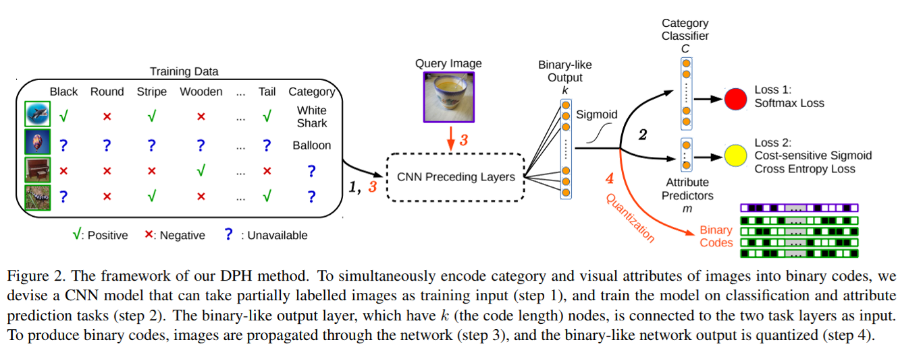
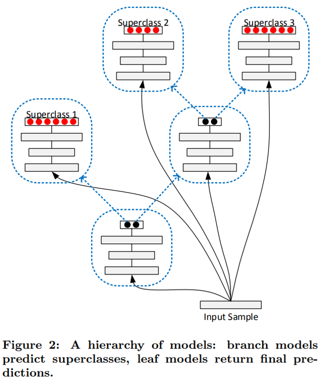
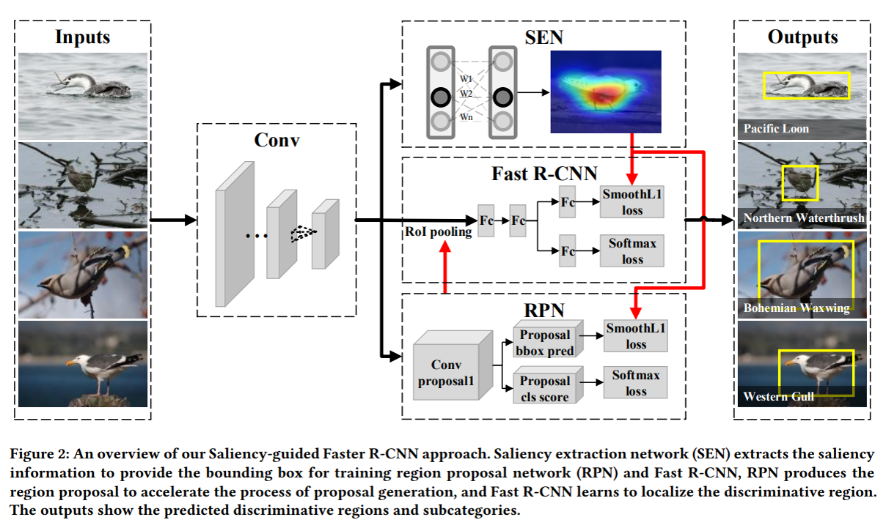

# CNCC2017中的深度学习与跨媒体智能
转载请注明作者：[梦里茶](https://github.com/ahangchen)

## 目录
- 机器学习与跨媒体智能
  - 传统方法与深度学习
    - 图像分割
    - 小数据集下的深度学习
    - 语音前沿技术
  - 生成模型
    - 基于贝叶斯的视觉信息编解码
    - 珠算：基于别噎死推断的深度生成模型库
    - 图像与视频生成的规则约束
      - 景深风景生成
      - 骨架约束的人体视频生成
  - 跨媒体智能
    - 视频检索的哈希学习
    - 多媒体与知识图谱
    - 基于锚图的视觉数据分析
    - 视频问答
    - 细粒度分类
    - 跨媒体关联与检索（待补充）
  
正片开始

## 传统方法与深度学习

### 图像分割
图像分割是医疗图像中一个很重要的任务，通常分为分割，配准，可视化几个子任务。这里贴一张广义的图像分割的图：

#### 存在的困难：
- 不同目标区域亮度一致，区分度小，
- 不同目标区域边界模糊，
- 图像采集存在噪声

#### 常用分割步骤
检测（定位）-> 边界寻优

#### 常用分割方法
- 按照图像中区域的能量与联系，建立`图模型`，用图割，图搜索的方法对图像进行分割
- `外观模型`：特定的目标区域往往具有特殊的外观，包括轮廓，形状，可以用外观模型进行匹配，做粗粒度的分割，或者对细粒度处理后的图像进行校正
- 多模态图像处理：融合`结构信息`和`功能信息`进行分割
  - 对准两个模型（结构和功能）的图像，对两个模型的预测结果进行约束（比如希望两个模型的输出相近）
  - `双模型交互迭代优化`
- 多边形近似
  - 对于某种目标区域，有着固定的多边形外观，可通过多边形近似的方法，标记出图像中近似的特征点 
  
### 语音前沿技术

#### 任务
降噪，增强，杂音分离，消除回响

#### 结合领域知识和DNN
- 数据标注：结合领域知识提出需要标注哪些数据
- 不直接学习目标，而是根据领域知识将目标任务进行分解
  - 比如识别字母，分解为识别摩擦音，爆破音
- 将传统模型中里程碑式的东西拿过来用

#### 移动端语音挑战
模型压缩，轻量化

## 生成模型

### 基于贝叶斯的视觉信息编解码

#### 任务
- 视觉信息编码：视觉信息通过人脑转为神经活动的过程
- 视觉信息解码：神经活动新号转为视觉信息的过程

#### 模型（基于卷积和反卷积的自编码器）
- 推理网络：卷积神经网络，得到中间特征，建立中间特征与神经活动信号之间的关联，从而得到神经活动得到编码
- 生成网络：将神经活动进行反卷积，得到图像
- 对于两个信号，学习两个信号产生于同一对象的概率（相似度分析），建立起一个贝叶斯推断模型

#### 多视图生成式自编码器
除了视觉数据之外，还有其他模态的数据，可以根据多个模态的数据构建多视图的生成时自编码器

### 珠算：基于贝叶斯推断的深度生成模型库

#### 任务
大数据中有许多不确定因素，需要学习对不确定性建模
#### 模型

给定一个输入z，用神经网络学习变量x的分布的参数（均值和方差），约束生成样本与真实样本的相似性

#### 有约束的GAN

在GAN的基础上，加一个分类器C，对生成器G生成的对象加中间约束，使得生成的对象更符合实际需求，比如生成不同姿态的人脸，要求不同人的人脸尽量不同，同个人的人脸尽量相同。

#### 珠算
- 基于Tensorflow的python库，无监督生成模型
- 贝叶斯推断
- 适合传统多层贝叶斯推断模型以及深度生成模型
- 可用于
  - 多变量回归
  - 变分自编码器实现
- http://zhusuan.readthedocs.io

### 图像与视频生成的规则约束学习
- GAN成为无监督领域的新框架
  - WGAN，DCGAN
  - 在生成中，往往通过随机性引入创意
- 已有工作
  - 人脸姿态转换，人脸年龄转换，人脸表情转换
  - 图像超分辨率生成，画风转换，字体转换，图像转视频
- 应用
  - 动画自动制作，手语生成
  - 视频自动编辑（如生成不同天气情况下的风景）
 - 创意+规则约束+复杂场景+复杂交互
 
- 难点
  - 解空间巨大：需要找出解所在的低维子空间
  - 宏观结构的一致性（视频生成需要的像素感受野（pooling）很大，难以预测长期运动变化）
  - 微观结构的清晰度，要同时逼近多模分布，避免单模生成的结果不够精确

- 解决方法
  - 用领域中的规则去约束GAN，加入破坏规则的代价
  - 缩小预测空间，保证宏观结构，加快细节生成

#### 景深风景生成
- 难点：要求空间结构合理，不能有严重的模糊
- 约束：从现有风景图像中对景深关系建模（对区域进行标注， 不同区域，即图层，有不同的远近限制）
- 建立位置和对象的关系，得到某个位置有某个对象的概率分布
- Hawkes过程模型
- 根据对象对图层做分解，由概率约束建立图层约束（树在人之前的概率有多大）
- 层内DCGAN，层间LSTM聚合出整图

#### 骨架约束的人体视频生成
- 骨架运动有约束
- 骨架提取很鲁棒，可以得到很多有标签知识（传统方法用来提取知识），作为约束条件
- 静图+动作序列变动图
- CNN编码解码，孪生网络双输入进行生成
- 判别器：对生成和实际帧做Triplet loss优化
- gan loss和视频相似度loss相加
- 交互运动视频生成

#### 视频检索的哈希学习
> Learning Multifunctional Binary Codes for Both Category and Attribute Oriented Retrieval Tasks

视频检索基于图像检索，大规模图像检索对性能要求较高
- 图像检索
  - 任务：通常图像特征很大，直接检索特征太慢
  - 方法：
    - 用二进制编码出一个哈希值来表达特征
    - 对哈希值做高效的异或运算求相似度
    - 模型（添加了对二进制编码的约束，希望绝对值与1尽量相近）：

#### 多媒体与知识图谱
> Cross-media analysis and reasoning: advances and directions

- 任务：
  - 将文本，图像，语音，视频及其交互属性进行混合
  - 多源融合+知识演化+系统演化
- 难点：
  - 解决语义鸿沟（机器认识世界是什么）
  - 意图鸿沟（机器理解人要达到什么目标）
  - 离散的知识和连续的特征如何转化如何关联
- 典型问题：
  - 跨媒体知识学习推理，多媒体情感分析
- 现状：
  - 机器学习助力多媒体效果很好
  - 多媒体助力机器学习还不成熟
  
- 任务：
  - 跨媒体深度分析和综合推理
- 方法：
  - 从浅层到深度
  - 知识图谱指导多媒体分析，属性补全
  - 深度学习+反馈（知识和规则进行反馈/强化学习）（黑箱方法）
  - 统计推理，贝叶斯推理（白盒方法）
- 趋势：
  - 知识表达理解，多媒体理解

#### 基于锚图的视觉数据分析
- 图学习
  - 对视觉数据可以计算相似度，对于整个数据集就可以得到一个相似度矩阵，学过图论的同学都知道，矩阵就是图
  - 相似度矩阵 -> 图的邻接矩阵 -> 用图的方法对邻接矩阵进行优化
  - 标号建模 标号平滑 标号学习
- 锚图学习（速度+）
  - 这是一种coarse to fine的思路
  - 利用数据点图，生成锚点图，先采一部分有代表性的数据（例如聚类中心）生成一个图模型，然后推理出其他图
  - 图模型中需要建立表示矩阵（特征工程），邻接矩阵（度量学习），并加快相似度计算
- 高效锚图（性能速度+）
  - 从数学上优化锚图的约束条件，使得优化问题的复杂度大大降低
- 层次化锚图（速度++）
  - 建立多层的锚图，也就是对采样点再采样
  - 锚点是线性增加的，也会增加得很快
  - 对第一层采样的点做再采样，多层采样减少了锚点数目，从最少的锚点的层逐层推理
- 标号预测器（速度+++）
  - 优化对锚点的标号（打伪标签进行半监督学习）
  - 对最小的锚点层接一个优化器进行标号预测
- 主动学习（样本选择）
  - 是一种hard mining的思路，选择更有用的样本作为锚点
  - 减小标号的误差损失
- 对比Google Expander Graph Learning平台：经典方法，并行运算，而锚图可以通过并行进一步提升速度

#### 视频问答
- 任务：
  - 输入视频，问题，输出答案
- 模型（层次记忆网络+视频时序推理）：
  - 对图像进行分层
  - 对问题进行记忆
  - 用文本和图像特征一同训练生成答案
  - 用LSTM做时序推理

### 细粒度分类
- 任务：
  - 识别图像同一大类中的子类
- 挑战：
  - 姿态视角不同导致类内差异大，外形颜色相似导致类间差异小

#### 基于模型动态扩容的增量深度学习方法
论文：Error-Driven Incremental Learning in Deep Convolutional Neural Network for Large-Scale Image Classification

- 将目标的多个类别按相似度划分为几个大类，
- 增加一个新的类别时，将其归入最相近的大类中，重用大类的参数，扩展小类分类层参数
- 利用类别子集合划分实现模型动态扩容，利用特征迁移学习实现训练加速（对类别做聚类）

#### 局部两级注意力深度模型
> The Application of Two-level Attention Models in Deep Convolutional Neural Network for Fine-grained Image Classification

给定图片-类别，不给出对象位置（bounding box）和局部的位置(part location)，用Attention学习对象位置和局部特征

- Object level: 首先用公开的数据集预训练模型，top-down地作用在整图上，选出跟目标相关的区域（响应度最高的区域），相当于抠图，对抠过的区域再加上类别标签进行迁移学习。

- Part level: 
  - 对于Object level得到的模型，对卷积层的filter做相似度聚类，同一类的卷积层合为一个part detector，用来为具体的对象局部做识别

- 结合总体评分和局部评分来对对象做细粒度分类

#### 空间约束的显著性部件选择模型
> Weakly Supervised Learning of Part Selection Model with Spatial Constraints for Fine-grained Image Classification

- 显著性提取和协同分割定位对象
- 先通过显著性聚类提出备选局部，
- 再对局部位置关系提出两个空间约束：局部和整体必须有尽可能多的重叠，局部之间有尽可能少的重叠。

上面两篇都是不需要局部组件的标注，就学到了局部的特征和约束

#### 显著性引导的细粒度辨识性定位方法
> Fine-grained Discriminative Localization via Saliency-guided Faster R-CNN

结合分类模型和检测模型做更高精度的细粒度分类

- 显著性模型提供弱标记的图片训练faster r-cnn检测模型
- 检测模型提供更精确的备选区域进行分类

#### 视觉文本联合建模的图像细粒度表示
> Fine-grained Image Classification via Combining Vision and Language

- 在图片数据集的基础上，增加对图片的描述文本，利用这两个模态的数据提供更高精度的细粒度分类
- 卷积做图像分类，CNN+LSTM做文本分类，两个分类结果合起来

### 跨媒体关联与检索
- 跨媒体统一表征学习：使用相同的特征类型表征不同媒体的数据
- 跨媒体相似度计算：通过分析跨媒体关联关系，计算不同媒体数据的语义相似性

这里的六篇论文我还没读完，读完之后补具体的理解

#### 跨媒体关联传递方法
> IJCV2013： Exhaustive and Efficient Constraint Propagation

#### 基于稀疏和半监督的统一表征方法
> Learning Cross-Media Joint Representation With Sparse and Semisupervised Regularization

#### 基于跨媒体语义单元的统一表征方法
> Semi-Supervised Cross-Media Feature Learning with Unified Patch Graph Regularization

#### 基于跨媒体多深度网络的统一表征方法
> Cross-media Shared Representation by Hierarchical Learning with Multiple Deep Networks

#### 基于多粒度层级网络跨媒体关联学习方法
> CCL: Cross-modal Correlation Learning with Multi-grained Fusion by Hierarchical Network

#### 跨媒体混合迁移网络方法
> Cross-modal Common Representation Learning by Hybrid Transfer Network, IJCAI2017

#### 跨媒体检索数据集PKU-XMedia
- www.icst.pku.edu.cn/mlpl/XMedia
- 五种媒体类型（图像、文本、视频、音频、3D）
- 10万标注数据，200个语义类别，基于wordNet的层次结构
- 来自Wikipedia, Flickr, Youtube, Findsounds, Freesound, Yobi3D
