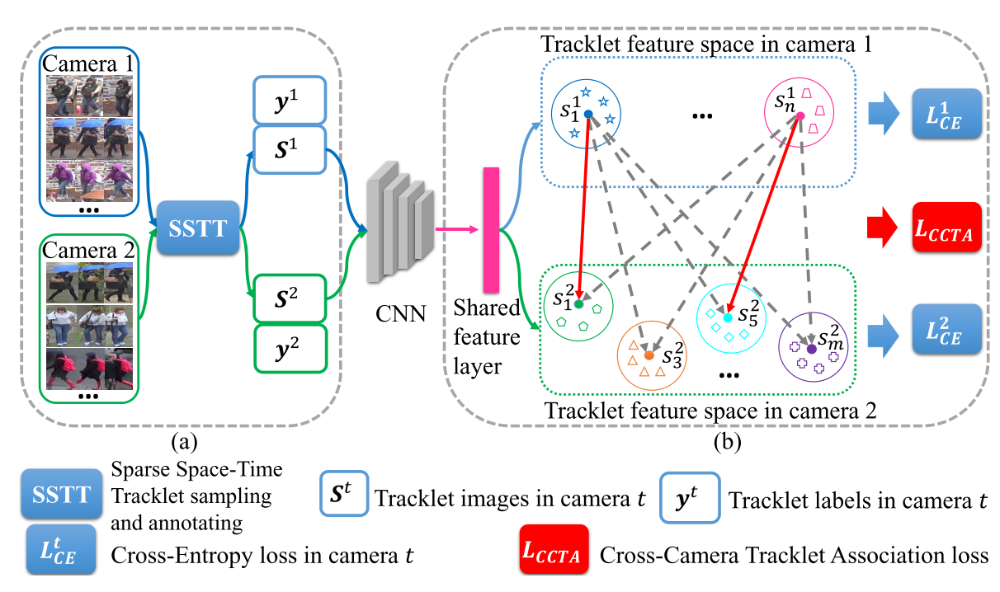
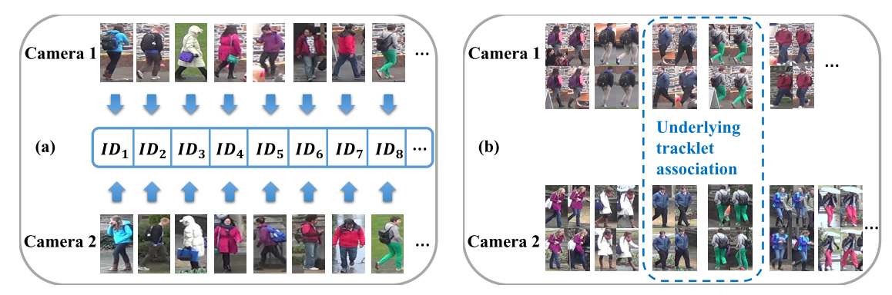

# ECCV2018:TAUDL

## ECCV 2018 TAUDL

> 转载请注明作者[梦里茶](https://github.com/ahangchen)

## Overview

关注Person reid这个领域的同学应该知道，有监督模型基本已经被刷爆了，2018年开始出现一些无监督/半监督/多模态的方法，包括我们之前做的结合时空模型的[TFusion](https://zhuanlan.zhihu.com/p/34778414)， 今天要介绍的也是结合时空数据的一个工作，由南京大学和QMUL的G.Shaogang老师合作发表在ECCV2018上的一篇论文：

> Unsupervised Person Re-identification by Deep Learning Tracklet Association

TAUDL是Tracklet Association Unsupervised Deep Learning的缩写，通过利用无监督的单摄像头轨迹信息（比如用detection和tracking的方法来提取监控视频中的行人轨迹）来训练端到端的神经网络，然后用这个图像模型对跨摄像头的图像进行自动标注和学习。具体如下：

## 无监督单摄像头轨迹标注

Person Re-id数据集通常用监控摄像头采集得到，所以有很多视频格式的reid数据集，对于这种数据集，我们可以直接应用detection+tracking模型来提取单个人的轨迹，但是由于tracking的模型也存在误差，单人的轨迹可能会被切成多段，我们要避免切成多段的这种轨迹被当做不同的人，所以需要对这样的轨迹数据做进一步的筛选才能用。这个筛选方法就是上图中的SSTT，Sparse Space-Time Tracklet sampling。具体而言，SSTT依赖于reid数据集的三个特点：

* 由于同个人不会在短时间内回到同个摄像头的视野内，因此同个人出现多段轨迹大多来源于tracking的误差
* 同时出现在不同位置的人应该是不同的人
* 同个人在单个摄像头中的迁移时间比较短，所以经过一个比较长的时间间隔P之后，出现的轨迹就不会是之前出现过的人的了

针对上面三个特点，提出了三个样本筛选规则（没错，这是手工规则）：

* 在同一个时间窗口内，为每个轨迹分配不同的id
* 同个时间内出现的不同轨迹，只选那些空间上离得比较远的（稀疏的空间采样）
* 在一个时间窗口采集轨迹后，要过一个time Gap P才采集新的轨迹（稀疏的时间采样）

用这三个规则过一遍所有的数据，我们就可以得到为每个摄像头得到一个轨迹和id的集合，这样我们就能用这些轨迹和id数据来训练图像模型了。

## 无监督跨摄像头轨迹关联学习

由于我们之前是为每个摄像头的数据独立分配轨迹id的，比较直接的思路是把不同摄像头的id都当做不一样的，但这样训练出来可能效果不好，因为同个人可能出现在不同摄像头里，将这种跨摄像头的正样本当成负样本去训练会出问题，所以我们希望能同时学习同摄像头内不同人的差异性以及不同摄像头内的同个人的关联性。

PCTD（单摄像头）：具体而言，假设有T个摄像头，我们有T个轨迹标记集，我们用T个集合训练出一个多任务（T个任务）图像模型，这T个任务共享用于特征表达的卷积层，但各自拥有自己的分类层，因为它们的ID是独立的，这种策略其实也平平无奇，是迁移学习常用的套路，而且计算量有点大，通过这种方式更多的是对单摄像头的数据做特征表达，还没将不同摄像头的数据关联起来。

CCTA（跨摄像头）：由于不同摄像头之间是有相同的人的，所以需要对不同摄像头的ID进行对齐，具体做法是，

* 在每个Batch做K近邻聚类（coding技能点满）：为每个轨迹在不同摄像头轨迹中寻找K个在特征空间中最相似的轨迹，将这些轨迹认为是相同人的轨迹，剩下的轨迹认为是不同人的轨迹
* 用聚类的结果训练图像模型，希望同人轨迹特征更接近， 不同人的轨迹特征更远离（用L\_{ccta}约束）。

PCTD和CCTA同时作为约束训练模型。

## 实验

由于TAUDL有了单摄像头的轨迹数据，比其他纯图像无监督方法要更鲁棒一点，CCTA的训练也一定程度上保证了跨摄像头的预测质量，因此效果也很不错。 

然而TAUDL这个方法依赖于视频数据集中的帧间关联性，对于图片数据集，如CUHK03这种连帧号都不保留的数据集，TAUDL是没办法提取出轨迹的，邮件问过作者，他们是用person ID来提取的轨迹信息，所以不算是严格无监督的方法，算是这个方法的一个美中不足吧。

