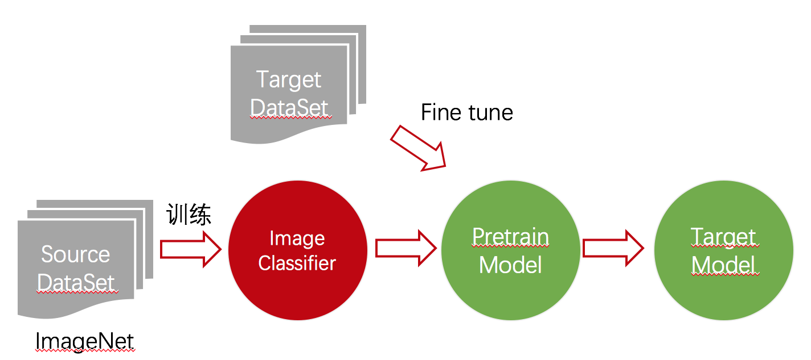
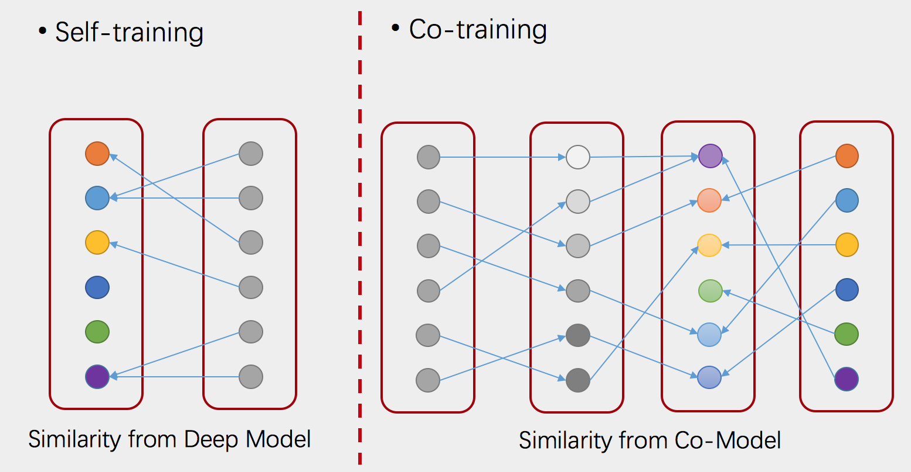

## 读论文系列：Deep transfer learning person re-identification
[arxiv 2016](https://arxiv.org/abs/1611.05244) by Mengyue Geng, Yaowei Wang, Tao Xiang, Yonghong Tian

### Transfer Learning
旧数据训练得到的分类器，在新的数据上重新训练，从而在新数据上取得比较好的表现，新数据与旧数据有相似的地方，但具有不同的分布。

### Fine tuning一般步骤
这是InceptionV4的图示

- 移除Softmax分类层
- 换成与目标数据集输出维数相同的Softmax层
- 冻结靠近输入的卷积层
- 以较高的学习率训练分类层
- 以很低的学习率微调剩下的卷积层

### 论文核心模型

几个创新点：

- 对于CNN输出的两张图的特征，使用了相同的dropout而非各自独立的随机dropout
- 使用了二分类加多分类两种loss，二分类用于判断两张图中的人是否相同，多分类用于描述两张图中各自的人物ID
- 分两阶段进行Fine tune，先微调多分类，再联合二分类和多分类进行微调，避免多分类网络不稳定对二分类的影响

### Unsupervised Transfer Learning

#### Self-training
- 将图片均分为两组（论文中是按摄像头划分的）
- 将B组中的每张图片，与A组中CNN输出相似度最高的图片归为一类，从而构造出多分类标签
- 喂入CNN训练
- 迭代多次

#### Co-training
- 由于CNN输出的图片相似度不一定真的可靠，存在噪音，因此Self-training效果没有特别好
- 寻找一个互补的模型，将特征映射到另一个子空间中
- 将B组中的每张图片，与A组中子空间相似度最高的图片归为一类，构造多分类标签
- 喂入CNN训练
- 迭代多次

#### Co-Model
- CNN计算得到深度特征： $$𝑦=\theta(𝑥)$$
- Learn a subspace defined by a dictionary D and a new representation Z in the subspace.
- $$(D^*, Z^*) = min_{D,Z} ||Y-DZ||_F^2 + \lambda\Omega(Z) s.t. ||d_i||_2^2 \leq 1 $$
- 其中$$||Y-DZ||_F^2$$是reconstruction error
- $$\Omega(Z) = \sum_{i,j} W_{ij}||z_i - z_j||_2^2$$
  - 当$$y_i$$和$$y_j$$是最近邻时，$W_{ij}$为1，否则为0
  - 从而最小化最近邻的representation z的差异

### Trick Result
- Softmax loss VS Multi loss： 76.6% -> 83.7%（Market1501）
- 一致的Dropout VS 随机的Dropout： 80.8%-> 83.7% （Market1501）
- Two-stepped VS one-stepped: 47.6%->56.3%(VIPeR)

### Supervised Transfer Learning Result

|DataSet|State of the art|Transfer|
| :-:| :-:  | :-:  |
|CUHK03|75.3|85.4|
|Market1501|82.21|83.7|
|VIPeR|53.5|56.3|
|PRID|40.9|43.6|
|CUHK01|86.6|93.2|

(表中都是top1准确率)

### Unsupervised Transfer Learning Result

|DataSet|State of the art|Transfer|
| :-:| :-:  | :-:  |
|VIPeR|33.5|45.1|
|PRID|25.0|36.2|
|CUHK01|41.0|68.8|

### Compare with other unsupervised method
使用其他无监督方法进行实验对比

|Method|Top1 acc|
| :-:| :-:  | :-:  |
|Self-training|42.8|
|SubSpace|42.3|
|Transfer|45.1|
|CNN+AutoEncoder|36.4|
|Adversarial|22.8|

其中SubSpace为只使用Co-Model，不使用CNN模型，Self-training为只使用CNN模型，Transfer是两者结合的Co-training。

总体来说这种无监督的方法取得了比较好的效果，在小数据集上甚至超过了有监督的效果。

如果觉得我的文章对你有帮助，可以前往github点个[star](https://github.com/ahangchen/windy-afternoon)

