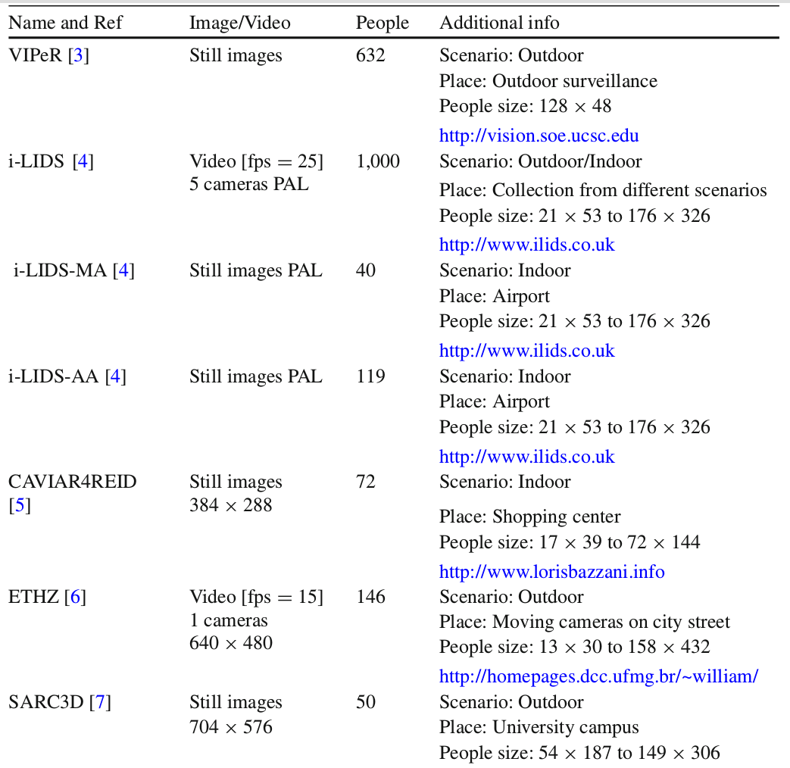

# Re-identification Overview

---

## 发展
- Multi-camera tracking
- Multi-camera tracking with explicit “re-identification”
- 独立的re-id(image-based)
- video-based re-id（对单个人采样多个帧）
- deep-learning re-id
- end to end image-based re-id: 结合detection，做尽可能少的中间人工处理

---

## 目标
  - 在视频数据中找到人物（稀疏）
  - 关联大量不同摄像头捕捉到的人物
  - 自动匹配和追踪人物
  > Detect -> Track -> Retrieval

  通常认为的Re-id只是指Retrieval这个过程
  - Re-id当做identification任务时，目标类似聚类或分类
  - Re-id当做recognization任务时,目标类似Ranking
---

## 数据
  - video-based
  - image-based
  - 个体的动作行为
  - 长期的活动模式
---

---

---
## Person Reid数据集收集
http://www.liangzheng.org/Datasets.html

https://robustsystems.coe.neu.edu/sites/robustsystems.coe.neu.edu/files/systems/projectpages/reiddataset.html

---

- 数据越来越多
- 边界倾向于由行人检测器（DPM，ACF）生成，但这种检测器可能会错标，导致re-id准确率下降
- 摄像头越多需要越大的泛化能力
- 训练性能逐年提升
- 深度学习方法取得优势
- 大规模数据集上还有提升空间(mAP准确率极低，性能有很大提升空间)，泛化能力弱

## 特点与困难
- 数据
  - 摄像头采集到的图像数据的视角，环境，时间等都不同
  - 摄像头中出现的不同的人会相互干扰
  - 一个人会出现在不同的摄像头中
  - 摄像距离不确定，人数不确定
  - 训练数据与真实环境不一致，搜索空间大小不确定

---

## Detect
  - object detection圈出人物的精度不能完全满足re-id的需求
  - 人工识别代价高，不准确，经验不可迁移，需要自动re-id

---

## Feature
  - 人脸识别和图像细节不可靠，太模糊
  - 一般基于视觉特征，如衣着，持有物，但这些特征辨识度很低，且很容易受光线视角影响，而且在衣着变化大的场合直接失效
  - 特征表达很受摄像头影响
  - 特征类内差异大于类间差异：同一个人在不同地方的样子的差异大于不同人的差异

---

## 建模和系统设计
  - 类间差异有时候小于类内差异
  - 样本少，因此往往不当多分类问题来做，而当做二分类问题做，给定一个人，判断是不是同一个人
  - 需要数据标记，因此需要少的训练数据的算法往往更受青睐
  - 不同摄像头间泛化能力弱
  - 性能
  - 长时间的re-id，人物可能换衣服，拿不同的东西，短时的特征会变得不可靠

---

## Video-based
- multi-shot：计算代价更高，问题更多
- pooling-based：聚合多帧特征为一个vector，可扩展性更高
- 建立索引
- stable region的stable可以加上时间的概念
- 在时间上做聚类
- 条件随机场（CRF）联合时空限制
- 在最后一层注入时间信息
- 喂入RNN记忆帧的时间流

---

##  评价标准：
- Rank-1 accuracy：匹配百分比，
- CMC curve：匹配的出现在rank的前x的百分比
- mAP: 不仅衡量是否匹配，还衡量匹配的图是否完整（即可能有多个匹配的图）

---

## 研究热点
  - 寻找受环境影响少的feature representation
  - ML优化Re-id模型

---

## 步骤
  - 输入轨迹或包含行人的矩形（可能由视频监控系统生成）
  - 提取图像特征，而不仅是像素点
  - 构建一个可视化的feature representation，比如feature的柱状图
  - 比较特征的相似度来匹配人物
  - 匹配策略可能影响特征和超参数

---

## 特征表达

  > 提取颜色，纹理，空间结构，容易可靠测量，不同人不同摄像头间这些特征都有一些区分度

  - 通常结合多种视觉特征，做成特征直方图，给不同特征加权重，但特征越多越可能出现图像匹配出错
  - 更进一步，会提取这样一些特征：
    -  WH: weighted color histogram（RGB, YUV, HSV）
    -  MSCR：maximally stable color regions
    -  RHSP: recurrent high-structured patches
  - re-id首先要行人检测，但行人检测的准确度不太能满足re-id的需求，如果没把行人圈出来，re-id的特征提取很容易受背景影响，所以很多工作会先尝试把行人抠出来
  - 检测不同肢体部位来判断姿态，利用对称特点；
    - 将行人图像分解成多个身体部位，比较不同部位之间的相似度
  - 捕捉人物身体3D特征，减小对衣着的依赖
  - 拥挤场所精确行人检测很困难，捕捉行人之间的关系，re-id一群人
  - `从视觉特征中提取语义用于re-id，比如发型，衣服风格`: mid-level feature represention

---

## 建模学习
  - 在相关的摄像头之间做迁移，亮度迁移，姿态迁移，背景迁移等
  - `距离测量`:找到一个量度差异的量，使得类中距离小，类外距离大：最近邻，信息理论，逻辑精度，概率相关，RankSVM
    - Match：最近邻算法，Mahalanobis距离函数(距离中加上权重)，KISSME（权重基础上引入概率）， ITML（引入信息理论，牺牲部分一致性使得距离度量与原始距离更接近），SVM，boosting, adaboost.
  - 减少数据标记需求：半监督稀疏标记，迁移学习
  - 把re-id当做推断问题来做，填充稀疏数据；条件随机场；
  - 上下文：合并同一轨迹上的多个帧，集合分析， 考虑外部上下文比如人群，学习摄像机网络的拓扑， 减少匹配搜索空间减少出错率。
  - 图像搜索：索引与哈希

---

## 实验环境与真实环境
  - 当前数据集的局限
  - 实际搜索空间巨大，会产生许多误判，需要结合环境中其他知识来筛选，或者摄像头拓扑推断人物出现在某一帧的可能性：同一个人在不同摄像头出现的时间表达了摄像头之间的距离，寻找人群活动模式的时空关系，
  - `人群re-id`
  - 基于服饰属性的特征描述
  - 工程上应用re-id成果的比较少，关注：相关性，容量，可用性。使用GPU，结合轨迹

---

## Other Idea
  - 多模态：结合红外信号，或者其他人的能量信号：运动时，能量的转移和消耗因人而异；利用声音信号
  - Deep learning
    - 缺乏训练数据：大多数re-id数据集中，一个人只有两张图，因此大多数研究采用多张图的组合
    - 将一张图分成若干个部分，传给CNN
    - LSTM记忆身体组件的空间连接关系
    - 在不同层都做compare（性能不好）
    - 比较前先resize
    - identification比recognization更能充分利用标签

## 展望
 - 性能评估
 - 大数据在特征上建立索引
 - re-ranking匹配结果
 - 真实环境数据集上的准确率提高
